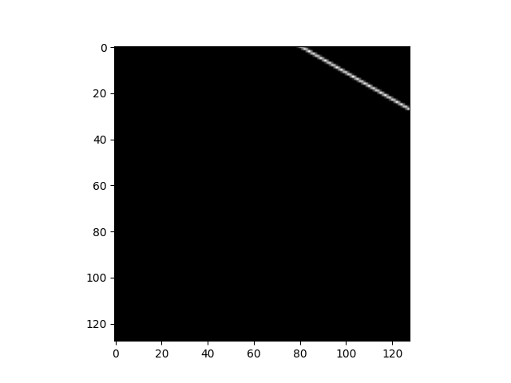

# Broadcasting
: 산술적인 연산을 진행할 때 shape가 다른 array가 어떻게 처리되는 지를 설명한다.

: Broadcasting이라는 용어의 시초는 numpy이며, 현재 matlab과 같은 다양한 라이브러리에서 사용된다.
 사전적 의미는 다음과 같다.

###verb (used with object), broadcast or broadcasted,broadcasting.
1. to transmit (programs) from a radio or television station.
2. to speak, perform, sponsor, or present on a radio or televisionprogram
3. to cast or scatter abroad over an area, as seed in sowing.
4. to spread widely; disseminate (흩뿌리고, 퍼트리고, 전파할 때 사용)
5. to indicate unwittingly to another (one's next action); telegraph:

Numpy Documentation

```
Broadcasting provides a means of vectorizing array operations **so that looping
occurs in C instead of Python.** It does this without making needless copies of data
and usually leads to efficient algorithm implementations.
```

→ c 언어에서 looping이 일어나도록 배열을 벡터화 시킴

- python list로 for loop을 돌면 굉장히 느리지만, vectorizing을 해주면 한번에 C로 처리할 수 있어서.(SIMD도 이용되기도 함)

→ 불필요한 데이터 복사 없이 효율적으로 알고리즘을 구현시킬 수 있는 도구

- 밑에 예시를 보장.
Ex) 배열의 element를 2배 씩 늘리는 경우

```python
a = np.array([1.0, 2.0, 3.0])
b = np.array([2.0, 2.0, 2.0])
print(a * b)
>> array([2., 4., 6.])
```

a 배열을 2배 늘릴려면 a와 shape가 같고 element가 2로 채워진 배열 b를 선언한 후 곱해줘야한다.

```python
a = np.array([1.0, 2.0, 3.0])
b = 2.0
print(a * b)
>> array([2., 4., 6.])
```

Numpy의 broadcasting을 사용하면 간단히 해결할 수 있다. (더 적은 메모리를 소요함으로 효율성이 더 좋다.)

```python
import numpy as np

a = np.array([1., 2., 3.])
b = 2.

print(a * b)
>> array[2. 4. 6.]
print(a + b)
>> array[3. 4. 5.]
print(a - b)
>> array[-1.  0.  1.]
print(a / b)
>> array[0.5 1.  1.5]
```

broadcasting 기능은 위와 같은 연산들을 제공한다.

### Pre-knowledge [Axis]

```python
a = np.array([[[1, 2], [3, 4]], [[5, 6], [7, 8]]])
print(a.shape)
>> (2, 2, 2)
```

axis 0: [[1,2],[3,4]] → [[5,6],[7,8]]로 진행되는 방향

axis 1: [1,2] → [3,4] 또는 [5,6] → [7,8]로 진행되는 방향

axis 2: 1 → 2 또는 3 → 4 또는 5 → 6 또는 7 → 8로 진행되는 방향

axis에 대한 sum 연산은 다음과 같다.

```python
a = np.array([[[1, 2], [3, 4]], [[5, 6], [7, 8]]])

print('axis 0')
print(np.sum(a, axis=0))
>> axis 0
	[[ 6  8]
	[10 12]]
print('axis 1')
print(np.sum(a, axis=1))
>> axis 1
	[[ 4  6]
	 [12 14]]
print('axis 2')
print(np.sum(a, axis=2))
>> axis 2
[[ 3  7]
 [11 15]]
```

## General Numpy Broadcasting Rules

Broadcasting에 대한 연산은 항상 적용되는 것은 아니다. 아래와 같이 충족 조건을 가져야 한다.

1. 두 배열의 axis가 같은 경우
2. 배열 중 하나의 axis가 1인 경우

배열의 경우 반드시 같은 차원을 가질 필요는 없다. 예를 들어 256 * 256 * 3을 가진 이미지 배열의 경우, 각 컬러 space를 scale하고 싶을 때 다음과 같은 연산으로 broadcasting을 진행할 수 있다.
```
Image  (3d array): 256 x 256 x 3
Scale  (1d array):             3
Result (3d array): 256 x 256 x 3
```
Ex)

```python
img = cv2.imread('./cat.jpeg')
scale = np.array([2,2,2])

print(img.shape)
>> (428, 428, 3)
print(scale.shape)
>> (3,)

new_image = img * scale
print(new_image.shape)
>> (428, 428, 3)
cv2.imwrite('cat_1.jpeg', new_image)
```
 

위 그림이 scale 적용 전, 아래 그림이 scale 적용 후 이다.
각 image RGB color space에 2배 씩 곱해 밝기가 높아진 것을 확인할 수 있다.

EX) Broadcasting이 가능한 경우

```
A      (4d array):  8 x 1 x 6 x 1
B      (3d array):      7 x 1 x 5
Result (4d array):  8 x 7 x 6 x 5
>> A의 axis 2개가 1, B의 axis 1개가 1

A      (2d array):  5 x 4
B      (1d array):      1
Result (2d array):  5 x 4
>> B의 axis가 1

A      (2d array):  5 x 4
B      (1d array):      4
Result (2d array):  5 x 4
>> A의 4와 B의 4가 똑같음

A      (3d array):  15 x 3 x 5
B      (3d array):  15 x 1 x 5
Result (3d array):  15 x 3 x 5
>> B의 axis가 1

A      (3d array):  15 x 3 x 5
B      (2d array):       3 x 5
Result (3d array):  15 x 3 x 5
>> A의 3, 5와 B의 3, 5가 똑같음

A      (3d array):  15 x 3 x 5
B      (2d array):       3 x 1
Result (3d array):  15 x 3 x 5
>> >> B의 axis가 1
```

EX) Broadcasting이 불가능한 경우

```
A      (1d array):  3
B      (1d array):  4
>> axis 길이가 다름

A      (2d array):      2 x 1
B      (3d array):  8 x 4 x 3
>> A의 axis 길이 2와 B의 axis 길이 4가 다름
```

# Sparse matrices (in Scipy)

: 배열에 0이 많은 것을 sparse하다고 말하고, sparse한 배열에서는 0이 아닌 element만 저장하기 때문에 메모리 측면에서 더욱 효율적이다.


sparse한 matrix를 그대로 컴퓨터에 저장하는 방법은 크게 2가지 문제점이 있다.

1. 많은 수의 0 element를 저장하는 것은 비효율적이다.
2. 더 중요한 이유는 0을 계산하는 것은 매우 비효율적이다.

(e.g.,: x + 0*y = x, you can skip the multiplication and addition operations)

matrix는 static, dynamic matrix로 나뉘는데, scipy에서는 static matrix에 대해 3가지의 sparse matrix format을 제공한다.

- Coordinate-wise (COO)
- Compressed Sparse Row (CSR)
- Compressed Sparse Column (CSC)

### COO

COO에서 sparse matrix는 3가지 array로 저장된다.

- **Val[N]**: contains the value of the non-zero elements
- **Row[N]**: contains the row-index of the non-zero elements
- **Col[N]**: contains the column -index of the non-zero elements

```
           0   1   2   3   4   5   6   7
      0 [ 11  12      14                 ]
      1 [     22  23      25             ]           
      2 [ 31      33  34                 ]          
      3 [     42          45  46         ]
      4 [                 55             ]
      5 [                 65  66  67     ]
      6 [                 75      77  78 ]
      7 [                         87  88 ]
Representation using Coordinate-wise method:
   Index   0    1    2    3    4    5    6    7    8    9   10
   -----------------------------------------------------------  
   Val    11   12   14   22   23   25   31   33   34   42   45   
   Row     0    0    0    1    1    1    2    2    2    3    3    
   Col     0    1    3    1    2    4    0    2    3    1    4  

   Index  11   12   13   14   15   16   17   18   19   20   21 
   ------------------------------------------------------------ 
   Val    46   55   65   66   67   75   77   78   87   88    -   
   Row     3    4    5    5    5    6    6    6    7    7    -   
   Col     5    4    4    5    6    4    6    7    6    7    -
```

Non-zero value만 저장되는 모습을 볼 수 있다.

stroage requirement: n == row_z, z==value

- **nnz** floating point, and
- **2*nnz** integer (indices). → ????

### CSR

- **Val[N]**: contains the value of the non-zero elements
- **RowPtr[N]**: contains the ***row-index range*** of the non-zero elements
- **Col[N]**: contains the column-index of the non-zero elements

```
        [ 11  12      14                 ]
        [     22  23      25             ]           
        [ 31      33  34                 ]          
        [     42          45  46         ]
        [                 55             ]
        [                 65  66  67     ]
        [                 75      77  78 ]
        [                         87  88 ]
Representation using Compressed Sparse Row method:
   Index   0    1    2    3    4    5    6    7    8    9   10
   -----------------------------------------------------------  
   Val    11   12   14   22   23   25   31   33   34   42   45   
   RowPtr  0    3    6    9   12   13   16   19   21    -    -
   Col     0    1    3    1    2    4    0    2    3    1    4  

   Index  11   12   13   14   15   16   17   18   19   20   21 
   ------------------------------------------------------------ 
   Val    46   55   65   66   67   75   77   78   87   88    -   
   RowPtr  -    -    -    -    -    -    -    -    -    -    -
   Col     5    4    4    5    6    4    6    7    6    7    -
```

CSR은 RowPtr을 도입해 COO의 Row를 더욱 간략하게 표현할 수 있다.

RowPtr은 Non-zero value의 row range를 표현한 array이다. 예를 들어 [0:3]까지는 1번째 col에 대한 element, [3:6]은 2번째 row에 대한 element, ... , [19:21]은 9번째 col에 대한 element를 의미한다.

## CT Scans

### Goal: CT 스캔 이미지로부터 압축을 진행하고, 이를 재구성한다.

왼쪽은 compressed CT image, 오른쪽은 original CT sample image 이다.
```python
# Generate Data
def generate_synthetic_data():
    rs = np.random.RandomState(0)
    n_pts = 36
    x, y = np.ogrid[0:l, 0:l]  # x.shape: (128,1) y.shape: (1,128)
		# If elements are less than 64^2, set the False, x^2 + y^2 < r^2
    mask_outer = (x - l / 2) ** 2 + (y - l / 2) ** 2 < (l / 2) ** 2 
    mx, my = rs.randint(0, l, (2, n_pts))  # mx.shape: (36,) my.shape: (36,)
    mask = np.zeros((l, l))
    mask[mx, my] = 1
    plt.imshow(mask, cmap='gray') # 1
    plt.show()
    mask = ndimage.gaussian_filter(mask, sigma=l / n_pts)
    plt.imshow(mask, cmap='gray') # 2
    plt.show()
    res = (mask > mask.mean()) & mask_outer
    plt.imshow(res, cmap='gray') # 3
    plt.show()
    return res ^ ndimage.binary_erosion(res)

if __name__ == "__main__":
    l = 128
    data = generate_synthetic_data()
    plt.figure(figsize=(5, 5))
    plt.imshow(data, cmap='gray') # 4
    plt.show()
```


(1) randint로 추출한 0~128 좌표에 대한 총 32개의 true 영역

(2) (1)에 대한 영역을 가우시안 필터링 처리 (이미지를 흐려지게 하거나, 노이즈를 줄이는 역할)

(3) ROI 영역 (반지름 64인 원)에 존재하는 평균 값보다 높은 영역과 논리곱을 통해 나온 이미지

(4) binary_erosion 메서드를 통해 res 이미지를 픽셀 최소치로 변환하여 이전 res 이미지와 논리합을 진행한다.

- binary_erosion → blur처리

Projection: n차원의 공간을 n-1차원으로 표현하는 것을 의미

```python
# Generate Projections
def _weights(x, dx=1, orig=0):
    x = np.ravel(x)
    floor_x = np.floor((x - orig) / dx)
    alpha = (x - orig - floor_x * dx) / dx
    return np.hstack((floor_x, floor_x + 1)), np.hstack((1 - alpha, alpha))

def _generate_center_coordinates(l_x):
    X, Y = np.mgrid[:l_x, :l_x].astype(np.float64)
    center = l_x / 2.
    X += 0.5 - center
    Y += 0.5 - center
    return X, Y

def build_projection_operator(l_x, n_dir):
    """Compute the tomography design matrix.

        Parameters
        ----------

        l_x : int
            linear size of image array

        n_dir : int
            number of angles at which projections are acquired.

        Returns
        -------
        p : sparse matrix of shape (n_dir l_x, l_x**2)
        """
    X, Y = _generate_center_coordinates(l_x)
    angles = np.linspace(0, np.pi, n_dir, endpoint=False)
    data_inds, weights, camera_inds = [], [], []
    data_unravel_indices = np.arange(l_x ** 2)
    data_unravel_indices = np.hstack((data_unravel_indices,
                                      data_unravel_indices))
    for i, angle in enumerate(angles):
        Xrot = np.cos(angle) * X - np.sin(angle) * Y
        inds, w = _weights(Xrot, dx=1, orig=X.min())
        mask = (inds >= 0) & (inds < l_x)
        weights += list(w[mask])
        camera_inds_prev = inds[mask] + i * l_x
        camera_inds += list(camera_inds_prev.astype('int'))
        data_inds += list(data_unravel_indices[mask])
		
		# Highlight
    proj_operator = sparse.coo_matrix((weights, (camera_inds, data_inds)))

    return proj_operator

if __name__ == "__main__":
    l = 128
    proj_operator = build_projection_operator(l, l // 7)
    proj_t = np.reshape(proj_operator.todense().A, (l // 7, l, l, l))
    print(proj_t.shape) # (18, 128, 128, 128)

		# First coordinate: angle of the line
		# Second coordinate: location of line
		plt.imshow(proj_t[3,0], cmap='gray')
    plt.show()
    plt.imshow(proj_t[3, 1], cmap='gray')
    plt.show()
    plt.imshow(proj_t[3, 2], cmap='gray')
    plt.show()
    plt.imshow(proj_t[3, 40], cmap='gray')
    plt.show()
    plt.imshow(proj_t[4, 40], cmap='gray')
    plt.show()
    plt.imshow(proj_t[15, 40], cmap='gray')
    plt.show()
    plt.imshow(proj_t[17, 40], cmap='gray')
    plt.show()
```




해당 라인과 CT의 이미지를 중첩하면 아래와 같다.


AND 연산을 하면 다음과 같아진다.


```python
proj = proj_operator @ data.ravel()[:, np.newaxis]
print(np.resize(proj, (l // 7, l))[17, 40])
# 6.438449837260599
```

[17, 40]을 통과하는 데이터의 intensity는 6.438449837260599인 것을 확인할 수 있다.


마찬가지로 [3, 14]일 때 intensity는 2.137495373796554가 나온다.

```python
proj = proj_operator @ data.ravel()[:, np.newaxis]
proj += 0.15 * np.random.randn(*proj.shape)
plt.figure(figsize=(7, 7))
plt.imshow(np.resize(proj, (l // 7, l)), cmap='gray')
plt.axis('off')
plt.show()
```

위 코드를 통해 2304개 (각도: 18, index: 128)의 element에 대한 1차원 배열로 만들어 이를 시각화 할 수 있다.

- 2차원 배열로 reshape해서 보여주는건데, 2차원으로 보여준게 더 의미있어보임!

결과는 다음과 같다


## Reference

[https://nbviewer.org/github/fastai/numerical-linear-algebra/blob/master/nbs/4. Compressed Sensing of CT Scans with Robust Regression.ipynb#Broadcasting](https://nbviewer.org/github/fastai/numerical-linear-algebra/blob/master/nbs/4.%20Compressed%20Sensing%20of%20CT%20Scans%20with%20Robust%20Regression.ipynb#Broadcasting)

[https://docs.scipy.org/doc/numpy-1.10.0/user/basics.broadcasting.html](https://docs.scipy.org/doc/numpy-1.10.0/user/basics.broadcasting.html)

[https://nurilee.com/2020/05/23/numpy-broadcast-브로드캐스트란/](https://nurilee.com/2020/05/23/numpy-broadcast-%EB%B8%8C%EB%A1%9C%EB%93%9C%EC%BA%90%EC%8A%A4%ED%8A%B8%EB%9E%80/)

[http://www.mathcs.emory.edu/~cheung/Courses/561/Syllabus/3-C/sparse.html](http://www.mathcs.emory.edu/~cheung/Courses/561/Syllabus/3-C/sparse.html)

[https://jw910911.tistory.com/19](https://jw910911.tistory.com/19)
  