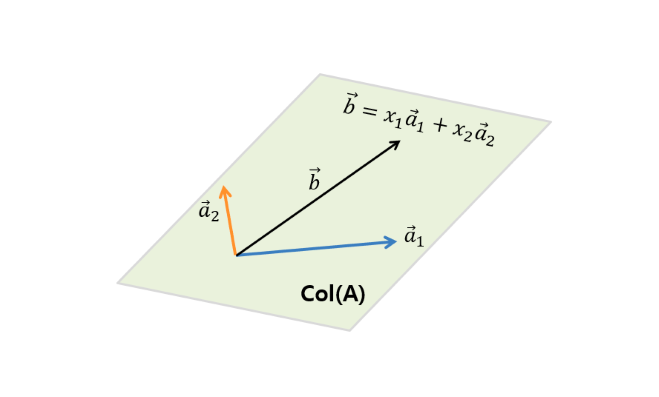
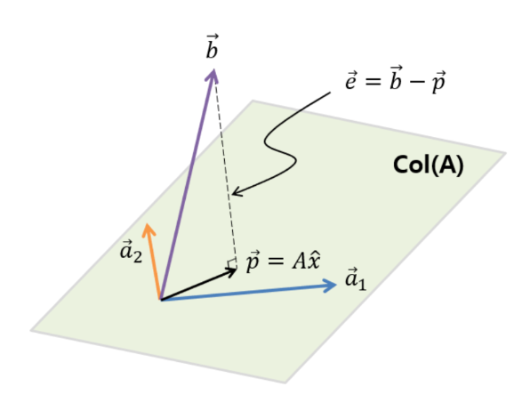
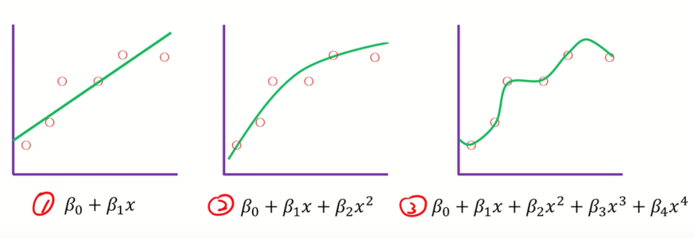
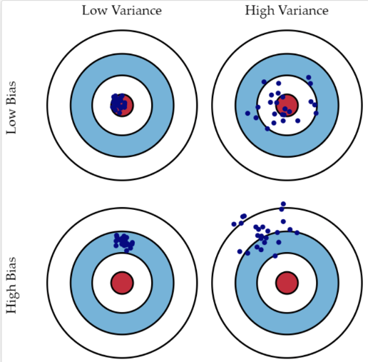
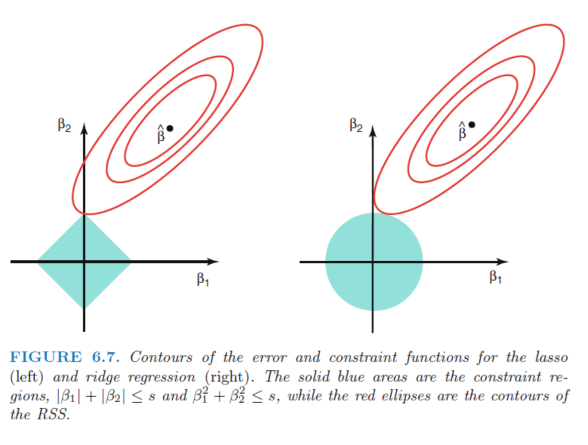
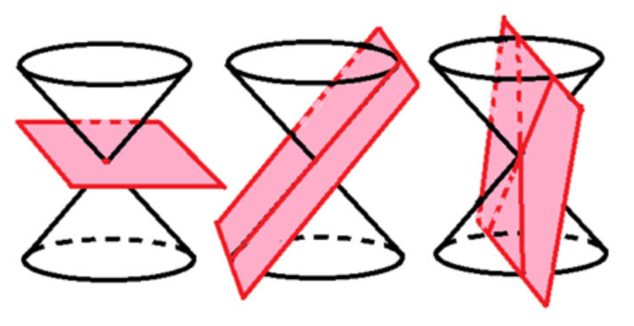
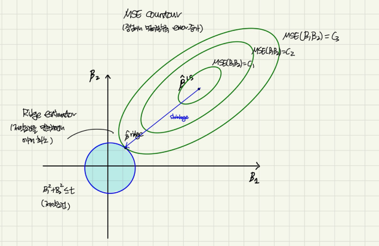
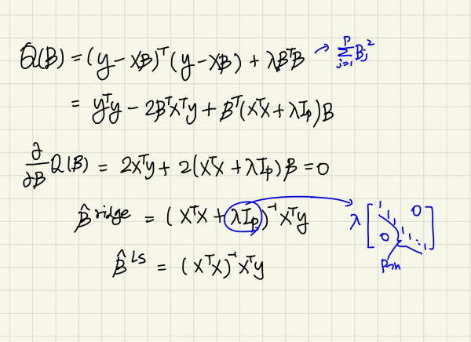
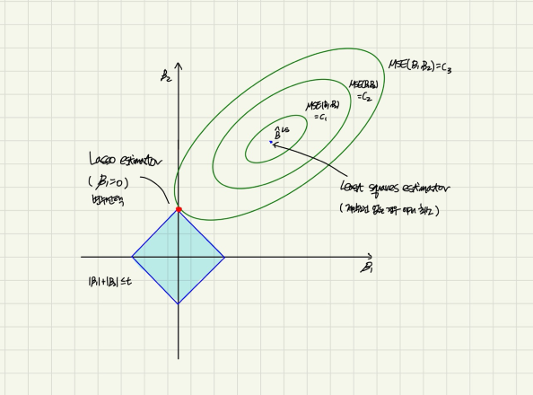

## Index
- Linear regression
- 선형대수 관점에서의 linear regression
- Least square estimation
- Ridge, Lasso regression
- numba


## Linear Regerssion
Linear regression : 종속변수 y와 한 개 이상의  변수 x 와의 선형 관계를 모델링하는 분석 기법

Regression : ‘**회귀**’ 의 사전적 의미 :  ‘한 바퀴 돌아 제자리로 돌아가다' .. 그렇가면 뭐가 어디로 돌아가는 것인가? 

데이터가 추세선으로 회귀한다?  function approximation?   
오차의 합이 최소화되도록 하는 선을 찾는 것은 직관적으로 받아들이기에 그럴듯 하다.  그런데 ‘회귀’라는 말과는 무슨 관계일까?


Leas squares method(OLS)는 gauss markov theorem 하에서 best linear unbiased estimator 이다.  
잔차가 iid (independent and identically distrubuted random) 가정을 만족한다면,
- 잔차의 분포가 정규분포이다
- 잔차와 독립변수 X 사이에 상관관계가 없고, 자기 자신과도 상관관계가 없다.(independent)
- 잔차의 분포가 일정해야한다 (등분산성 만족)

즉 회귀모델이란 잔차(residual)가 평균으로 회귀하게 만든 모델이다.


## 선형대수학의 관점에서 본 회귀분석
(-1,0) , (0,1) , (0,3) 의 세 개의 데이터 포인트가 주어져 있다고 하자.  
만일 $f(x) = mx + b $ 직선이 세 점을 통과한다면 연립방정식은 다음 행렬식을 푸는 것과 같다.


$
(Ax = b )  ⇒  \begin{bmatrix}
  -1 & 1  \\
   0 & 1  \\
   0 & 1
\end{bmatrix}
 \begin{bmatrix}
  m \\
  b
\end{bmatrix}
=  \begin{bmatrix}
  0 \\
  1 \\
  3
\end{bmatrix}
$

$ 
A\overrightarrow{x} = \overrightarrow{b} 
$

$
  ⇒  \begin{bmatrix}
  | & |  \\
  \overrightarrow{a_1} & \overrightarrow{a_2}  \\
  | & |
\end{bmatrix}
 \begin{bmatrix}
  x_1 \\
  x_2
\end{bmatrix}
=  \begin{bmatrix}
  | \\
  b \\
  |
\end{bmatrix}
$ 
$
  ⇒   
  x_1 
\begin{bmatrix}
  | \\
  \overrightarrow{a_1}\\
  | 
\end{bmatrix}
  x_2 
\begin{bmatrix}
  | \\
  \overrightarrow{a_2}\\
  | 
\end{bmatrix}
=  \begin{bmatrix}
  | \\
  b \\
  |
\end{bmatrix}
$



행렬 A의 열벡터 $\overrightarrow{a_1}$ , $\overrightarrow{a_2}$ 의 선형결합 을 통해 $\overrightarrow{b}$  를 구하자.  
$\overrightarrow{b}$  가 $\overrightarrow{a_1}$ , $\overrightarrow{a_2}$ 의 span 안에 있다면 구할 수 있다.




하지만 위 그림과 같이 $\overrightarrow{b}$ 가 $col(A)$ 의 span 밖에 있다면?    
$\overrightarrow{b}$ 를 $col(A)$ 에 orthogonal projection 시킨 $\overrightarrow{p}$ 가 span 내의 최적의 벡터라고 볼 수 있다.  
$\overrightarrow{e} =\overrightarrow{b} -\overrightarrow{p} $ 이며  행렬 A의 어떤 벡터와도 직교하므로 다음 수식이 성립한다.
$$
A\cdot\overrightarrow{e} = \begin{bmatrix}
  | & |  \\
  \overrightarrow{a_1} & \overrightarrow{a_2}  \\
  | & |
\end{bmatrix}\cdot\overrightarrow{e} = 0 $$

$A^{T}(\overrightarrow{b} - A\hat{x})=0\\
A^{T}\overrightarrow{b} - A^{T}A\hat{x}=0 \\
A^{T}A\hat{x}= A^{T}\overrightarrow{b}\\
\hat{x} = (A^{T}A)^{-1}A^{T}\overrightarrow{b}$ 

https://angeloyeo.github.io/2020/08/24/linear_regression.html


## Least square estimation method 

평균제곱오차 (MSE) 를 최소화하는 회귀계수 $B = (B_1,...B_p)$ 를 계산한다.
beta 에 대한 unbiased estimator중 가장 분산이 작은 estimator를 BLUE라고 한다.

$$\hat{\beta}^{LS} = argmin_\beta \{\sum^{n}_{i=1}(y_i -x_i\beta)^2\} = (X^{T}X)^{-1}X^{T}y$$


Irreducible Error 은 모델이 해결불가능한 에러이다.  
그렇다면 Bias 와 Variance 중 무엇을 줄이는데 집중할 것인가? 
* 베타의 개수 p 보다 데이터의 수 n이 ‘충분히' 많으면서 가정된 분포가 어느정도 맞다면 least squares 는 상당히 좋은 low bias 의 추정을 한다

* 반대로 베타의 개수 p가 n 보다 충분히 많지 않으면 overfitting, 적다면 ols 의 해가 존재하지 않는다 (X(n*p)가 linearly dependent). 이를 해결하기 위한 방법을 살펴보자

  1) subset selection : 유의미한 변수 선택

  2) shrinkage : regularization (beta의 값을 축소시킨다)

  3) dimension reduction


## Regularization  

좋은 모델이란 무엇일까?  
학습 데이터에 대한 설명력이 높으면서, 미래에 대한 예측능력도 좋은 모델일 것이다.  
즉, 이상적인 모델은 트레이닝 데이터에서 반복되는 규칙성을 정확하게 잡아내면서도 학습되지 않은 데이터를 잘 일반화 할 수 있어야 한다.




- 1번 선형 모델 : underfit , high bias, low variance
- 3번 고차 다항함수 모델 : **overfit , high bias , high variance**
- 2번이 이 중에는 적절하다


## Regularization concept

현재 학습 데이터에 대한 정확도 말고도 미래 데이터에 대한 정확도를 어떻게 해야 높일 수 있을까.   
베타에 대한 제약(penalty)을 줘서 generalization accuracy 도 고려를 해보자


$ L(\beta) = \underset{\beta}{min}\underset{i=1}{\sum} (y_i -\hat{y_i})^2 + \lambda\overset{p}{\underset{j=1}{\sum}}\beta_j^2 $

$\lambda$  : `regularization parameter` that controls trade-off between bias and variance 

1) $\lambda$  very big : 만약 10,000이라면 베타는 0이 된다.. - underfitting

2) $\lambda$  very small : 만약 0이면 least squares와 동일하다. high variance -overfitting


- regularization method는 회귀 계수 beta가 가질 수 있는 값에 제약조건을 부여하는 방법이다.
- 제약조건에 의해 bias가 증가할 수 있지만 variance는 감소한다.





## Ridge regression 

- **L2-norm regularization**
- 잔차의 제곱을 최소화하면서도 회귀 계수 베타의 L2-norm 을 제한한다
- 아래 두 식은 동일하다
$$ 1. \ \hat{\beta}^{ridge} = \underset{\beta}{argmin}\{\overset{n}{\underset{i=1}{\sum}} (y_i -x_i\beta)^2 +
 \lambda\overset{p}{\underset{j=1}{\sum}}{\beta}_j^2\} $$

$$ 2. \ \hat{\beta}^{ridge} = \underset{\beta}{argmin}\overset{n}{\underset{i=1}{\sum}} (y_i -x_i\beta)^2 \\
subject\ to\ \overset{p}{\underset{j=1}{\sum}}{\beta}_j^2\leq{t} $$

- MSE Contour


Conic equation 의 Discriminant (판별식) < 0 일 때,  ellipse (타원) 의 형태를 띈다.

- $B^2 -4AC < 0 $   : ellipse(타원)
- $B^2 -4AC > 0$  :  hyperbola (쌍곡선)
- $B^2 -4AC = 0$  : parbola (포물선)
- $B=0, \ A = C$ : circle(원)



ridge의 제약범위는 원이기 때문에 축에서 교점이 생기지 않는다. 따라서 베타가 0이되지는 않으면서 0의 방향으로 shrink한다.  
반면 lasso의 제약범위는 사각형이므로 축에서 교점이 생긴다. 그림에서는 $\beta_2$=0 으로  $\beta_2$는 제외되게 된다. (MSE가 커지더라도, 따라서 bias가 커지더라도 variance를 줄이는 방식)  
차원이 커지더라도 (d=3)  제약범위는 ridge 는 구, lasso는 다면체가 되므로 같은 성질을 유지한다.


- Ridge 는 행렬 연산을 통해 closed form solution 을 구할 수 있다




### Lasso regression

- Least Absolute Shrinkage and Selection Operator (lasso)
- L1-norm regularization : 회귀 계수 베타의 L1-norm 을 제한
- sparse solution

$
\ \hat{\beta}^{lasso} = \underset{\beta}{argmin}\overset{n}{\underset{i=1}{\sum}} (y_i -x_i\beta)^2 \\
subject\ to\ \overset{p}{\underset{j=1}{\sum}}{|\beta|}_j\leq{t} 
$



- Ridge 와 달리 Lasso fomulation 은 closed form solution 을 구하는 것이 불가능하다

- Numerical optimization method
  - Quadratic programming techiniques
  - LARS algorithm
  - Coordinate descent algorithm  


- Tuning parameter($\lambda$)

  Ridge와 Lasso는 λ를 조정하여 최적모형을 구하며 그 과정에서 Cross-Validation을 사용한다

  [1] 고려할 λ의 범위(grid)를 선택한다.  
  [2] 각 λ값에 대해 cross-validation error를 구한다.  
  [3] error를 가장 작게 해주는 λ값을 선택한다.  
  [4] 마지막으로, 선택된 λ값을 이용해 모형을 재적합시킨다.


  ## Conclusion 

- Ridge, Lasso 는 모두 분산(variance)을 줄이기 위해 회귀계수 $\beta$ 를 shrink 하는 method이다
- 일반적으로 ridge는 변수들의 상관관계가 높은 경우에(collinearlity) 상대적으로 좋은 예측 성능을 보이나
모든 계수들을 완전히 0으로 축소시키지 않기 때문에, 모델이 복잡해지고 해석이 어렵다
- Lasso 는 회귀계수 추정치를 완전히 0으로 수축시키기 때문에 변수 선택이 가능하고 설명력이 좋다.
상대적으로 예측변수들 중 일부분의 예측변수가 큰 회귀계수를 가지고 나머지 예측변수가 작은 회귀계수를 가지거나 거의 0과 동일한 상황에서 우수한 성능을 가진다.


## Numba


<aside>
💡   
파이썬은 인터프리터 언어로서 C/C++/Fortran 과 같은 컴파일 언어에 비해 속도가 느리다.

Numba로 데코레이트된 함수를 호출하면 해당 함수가 즉석에서 바로 기계어 코드로 컴파일되고 원래의 기계어 코드 속도로 실행된다.
컴파일이 한번 완료되면 Numba는 해당 기계어 코드 버전을 저장해 놓는다. 그리고 같은 타입으로 다시 호출된다면 다시 컴파일하지 않고 미리 저장된 버전을 재사용한다.

</aside>

- 전체 애플리케이션, 프로그램이 아닌 데코레이터로 장식된 함수에 대해서만 별도로 컴파일한다.
- 특정 수치형 타입(int,float,complex)에 대해서 빠른 연산을 제공하므로 numpy array와 일반적으로 같이 사용한다
- 함수가 처음 호출되었을 때 컴파일한다(JIT)


### Jit

Jit은 just in time의 약자로, 데코레이터가 호출될 때 함수가 컴파일되고 그 이후에는 컴파일된 부분이 유지되기 때문에 기존 루프보다 속도가 훨씬 빠르다.  
또한 컴파일 영역에 선언되어있어 better locality를 가진다.

```python
@jit()
def proc_numba(xx,yy,zz):
    for j in range(nobs):   
        x, y = xx[j], yy[j] 
        x = x*2 - ( y * 55 )
        y = x + y*2         
        z = x + y + 99      
        z = z * ( z - .88 ) 
        zz[j] = z           
    return zz
```

### Vectorize
- Numba’s vectorize allows Python functions taking scalar input arguments to be used as NumPy [ufuncs](http://docs.scipy.org/doc/numpy/reference/ufuncs.html)
- ufuncs : universial function, array broadcasting, type casting 을 지원하는 operation function
- vectorize 데코레이터에 시그너쳐를 넘기면, 파이썬 함수는 Numpy ufunc으로 컴파일해준다

```python
from numba import vectorize, float64

@vectorize([float64(float64, float64)])
def f(x, y):
    return x + y

a = range(6)
f(a,a)
>>> array([ 0.,  2.,  4.,  6.,  8., 10.])
```

왜 @jit 데코레이터를 사용해서 단순 반복 루프를 컴파일하지 않고 vectorize를 쓸까
Numpy ufunc 의 특징들 (broadcasting, reduction, accumulation 등) 을 이용하기 위해서

```python
a= np.arange(12).reshape(3,4)/1.5
a
>>> array([[0.        , 0.66666667, 1.33333333, 2.        ],
       [2.66666667, 3.33333333, 4.        , 4.66666667],
       [5.33333333, 6.        , 6.66666667, 7.33333333]])

f.reduce(a,axis=0)
>>> array([ 8., 10., 12., 14.])

f.accumulate(a) 
>>> array([[ 0.        ,  0.66666667,  1.33333333,  2.        ],
       [ 2.66666667,  4.        ,  5.33333333,  6.66666667],
       [ 8.        , 10.        , 12.        , 14.        ]])
```

- numba는 많은 수의 반복문을 실행해야 되는 함수를 직접 만들어야 하는 경우 간
단히 데코레이터만을 추가함으로써 일반적인 파이썬 함수를 효율적으로 변환할 수 있다
- pandas와 같이 데이터프레임을 다루는 고수준의 라이브러리와는 호환이 되지 않는다

### other decorators

- `@njit` - 이것은 `@jit(nopython=True)`에 대한 별칭이며, 매우 자주 쓰이는 데코레이터이다.
- `@vectorize` - NumPy `ufunc`을 생성한다. (모든 `ufunc` 메쏘드가 지원된다)
- `@guvectorize` - NumPy `generalized ufunc`을 생성한다. 
- `@stencil` - 연산과 같은 스텐실을 위한 커널로서의 함수를 선언한다. 
- `@jitclass` - jit을 알고 있는 클래스 생성용. 
- `@cfunc` - C/C++로부터 호출될 수 있는 네이티브 콜백으로 사용될 함수를 선언한다.
- `@overload` - `@overload(scipy.special.j0)`와 같은 예처럼, 기존의 어떤 함수를 nopython 모드로 사용하기 위해서 해당 함수에 대해서 별도의 구현물을 등록한다. 


## Reference
https://brunch.co.kr/@gimmesilver/17
https://angeloyeo.github.io/2020/08/24/linear_regression.html