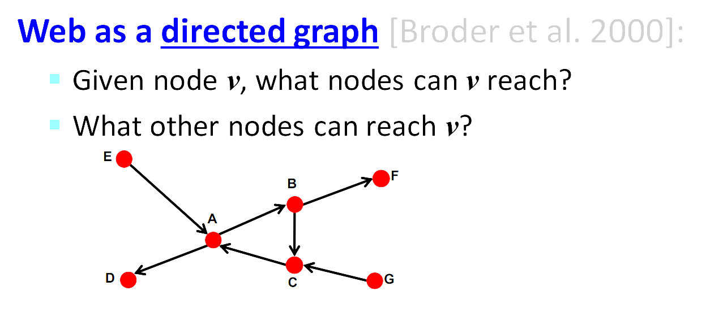
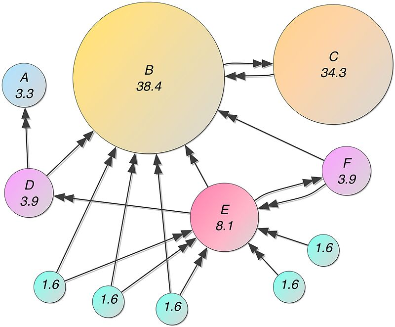
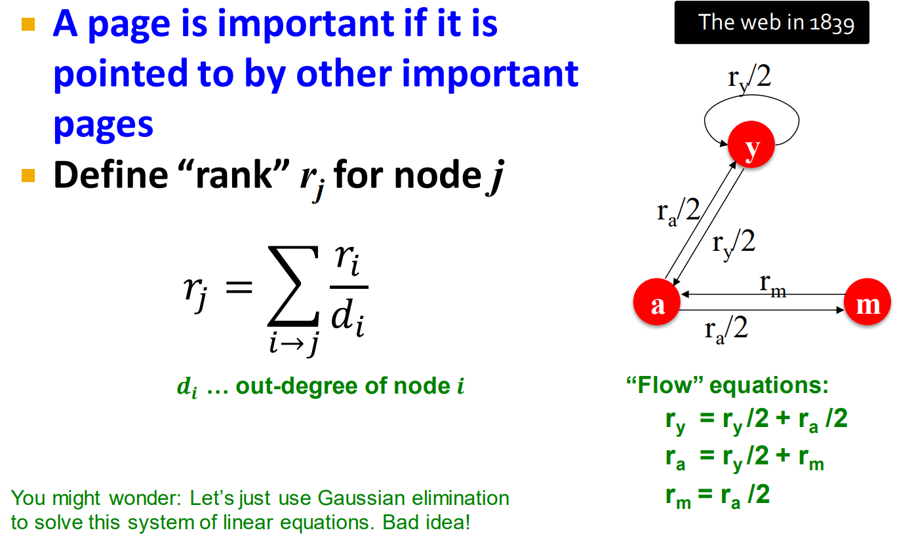
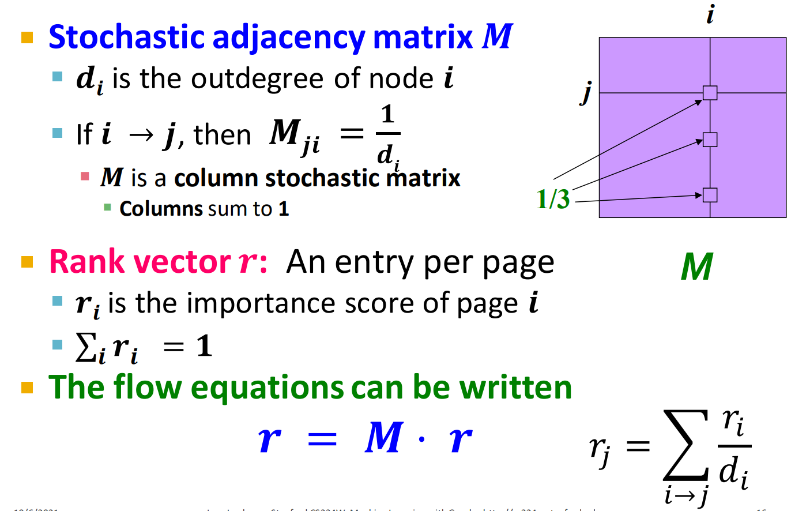
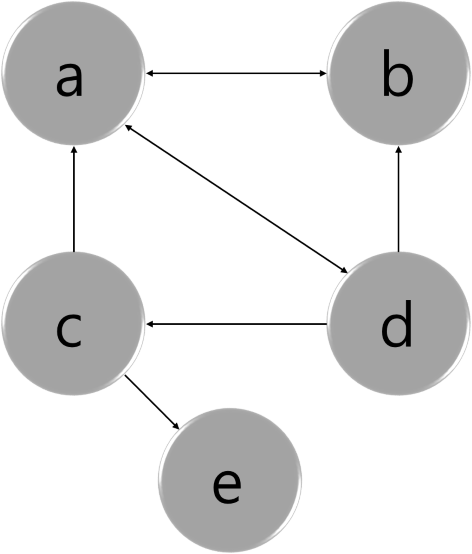
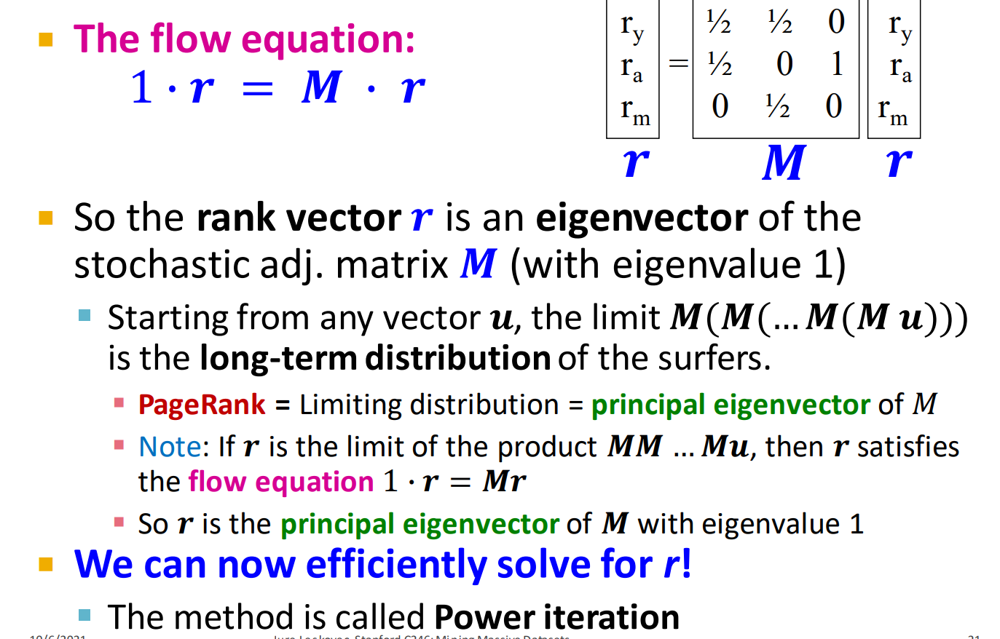
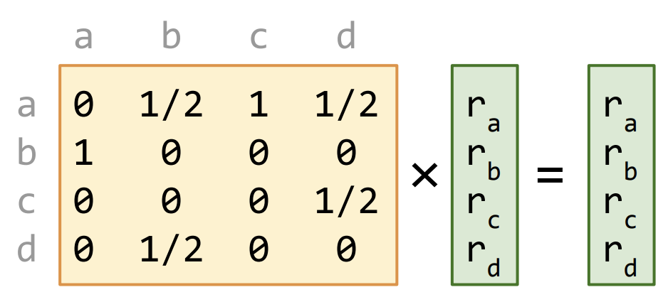
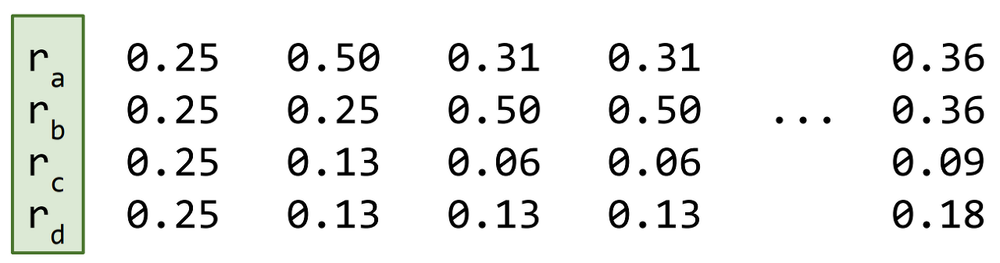
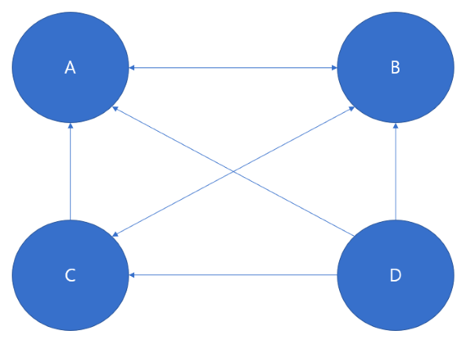

# PageRank

"Web"을 graph로 표현한다면?

* Nodes : web pages
* Edges : hyperlinks





위 그림은 웹 페이지를 노드로, 페이지 간 연결된 하이퍼링크를 엣지로 하여 그래프로 표현한 것이다.  
directed graph로 페이지 B가 C를 인용(링크)했다면 노드 B에서 C로의 화살표가 생긴다. PageRank 의 컨셉은 이러한 링크 정보를 이용하여 노드(페이지)마다 rank를 매기자는 것이다.




* Stochastic matrix M

하지만 모든 웹페이지들이 ‘동일한’ 중요도를 가지지는 않는다.  
많은 페이지로부터의 링크(인용)를 가진 페이지 혹은 중요한 페이지로부터 링크된 페이지일 수록 rank가 클 것이다.  
노드 j 의 rank 는 노드 j로 들어오는 node i의 out-link들로부터 중요도를 매길 수 있고 중요도를 node i의 degree로 나눠준다면 인접행렬을 stochastic adjacency matrix $M$ 으로 표현할 수 있다. 
M의 n승은 n번 링크를 걸쳐서 페이지에 들어올 확률인데, n이 무한히 커질 때(random walk interpretation) 수렴성을 보장하기 위해 확률의 개념을 도입한다.  이 때, column 의 합은 1이기 때문에 column stocahstic matrix라고도 한다.  

 


$ H = \begin{bmatrix}
  0 & 1 & 1/2 & 1/3 & 0  \\
   1/2 & 0 & 0 & 1/3 & 0  \\
   0 & 0 & 0 & 1/3 & 0 \\
   1/2 & 0 & 0 & 0 & 0 \\
 0 & 0 & 1/2 & 0  & 0 
\end{bmatrix} $  

$ S = \begin{bmatrix}
  0 & 1 & 1/2 & 1/3 & 1/2  \\
   1/2 & 0 & 0 & 1/3 & 1/2  \\
   0 & 0 & 0 & 1/3 & 1/2 \\
   1/2 & 0 & 0 & 0 & 1/2 \\
 0 & 0 & 1/2 & 0  & 1/2 
\end{bmatrix} $

* 위 그림과 같은 경우 노드 e (dangling node) 는 out-link 가없기 때문에 matrix H 의 모든 column 합을 1로 만들기 위해 전체 노드만큼의 수로 나눠준다   
$$ S = H + \frac{1e^T}{N} $$ 


## Rank Vector

 

랭크 벡터 $r_i$는 페이지i의 중요도를 의미한다.  
$r = M\cdot r $  
$1 \cdot r = M \cdot r$   로 본다면 rank vector 를 다음과 같이 해석할 수 있다.  
‘page rank vector r은 stochastic matrix M의 eigenvalue가 1일 때의 eigenvector’ 사진의 연립방정식의 해(rank)를 가우스 소거법을 통해 구할 수도 있지만, 그래프 사이즈가 클 때는 행렬을 이용한 Power iteration 을 통해 rank 를 구한다.  
power method는 행렬이 주어졌을 때, 해당 행렬의 principal eigenvector(주고유벡터)를 추정하기 위해 사용한다.

$M * v = \lambda * v$ 를 만족하는 고윳값, 고유벡터들은 많으나 수렴하는 경우 eigenvalue를 가장 크게 하는 (principla eigen)의 eigenvector 가 PageRank 의 rank vector 이다.  
stochastic adjacency matrix 기 때문에 eigenvalue 의 최대값이 1이라고 한다.


## Power Iteration Method

 
 
1) 처음에 모든 노드의 점수${(r_a, r_b, r_c, r_d)}$ 를 $\frac{1}{n}$ 로 초기화 (n은 노드 개수)
2) 행렬 곱셈을 통해, 모든 노드의 새로운 점수를 계산한다.
3) 노드 별 점수 결과를 우측 행렬로 다시 삽입한다.
4) 노드의 점수가 수렴할 때 까지, 2)부터 반복한다.


* 예제

 

``` python
import numpy as np

M = np.array([[0,1,0,0],
             [1/2,0,1/2,0],
             [1/2,1/2,0,0],
             [1/3,1/3,1/3,0]])

M = np.round(M,2)
M
>>> array([[0.  , 1.  , 0.  , 0.  ],
       [0.5 , 0.  , 0.5 , 0.  ],
       [0.5 , 0.5 , 0.  , 0.  ],
       [0.33, 0.33, 0.33, 0.  ]])
```
``` python
eigen_val, eigen_vec = np.linalg.eig(M)

#max eigenvalue
order =  np.absolute(eigen_val).argsort()[::-1]
eigen_vec = eigen_vec[:,order]
r = eigen_vec[:,0]
r = 100 * np.real(r/ np.sum(r))
print(r)
>>> [25.06265664 25.06265664 25.06265664 24.81203008]
```

논문에서는 값이 수렴하지 않는 그래프의 경우가 있기 때문에 damping, teleport 등의 기법을 사용하나 해당 내용은 다루지 않았다. 


## 질의응답

1) matrix 가 항상 eigendecomposition 이 가능한가?

    그렇지 않은 경우를 위해 deadend, spider trap 등을 사용한다.

2) eigenvalue 가 가장 클 때 (principal) 의미하는게 뭔지?

    eigenvalue가 1일 때는 계속 곱해도 크기가 유지된다. 즉 stochastic matrix를 계속 곱하더라도(페이지를 계속 참조하더라도) 유지가 될 가능성이 높고, 그걸 rank로 볼 수 있다.  
    크기가 유지되는 eigenvector는 실제 그 크기의 랭크라고 볼 수 있다.

3) 두번째로 큰 eigenvalue 의 크기에 따라서 convergence 속도가 좌우된다는 것에 대해서  
    $\frac{\lambda_2}{\lambda_1}$ 의 비율이 작을 수록 수렴이 빠르다.  
    power method자체가 계속 곱해지는 것이고, $\lambda_2$가 더 작을 수록 곱해질 때 0에 가까워질 것이니 수렴이 빨라질 것이다.
 