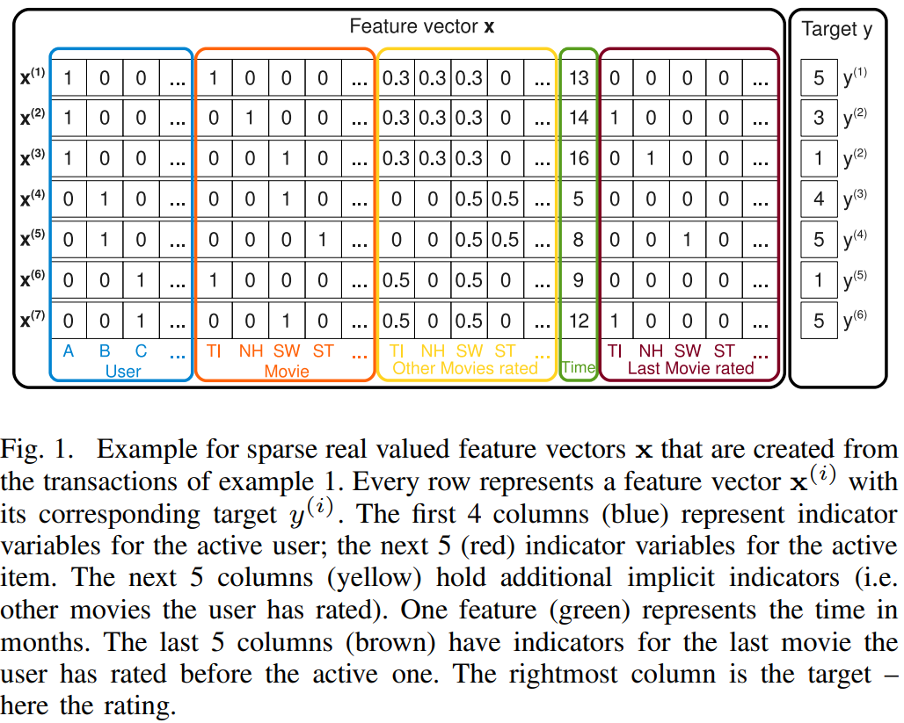
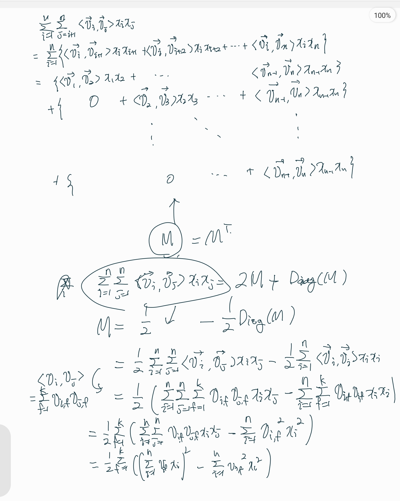

# 크루 세미나 #6 : Factorization Machines (for Recommendation System) 논문 리뷰

날짜: April 19, 2022
발표자: 박민호
참고 사이트 1: http://ethen8181.github.io/machine-learning/recsys/factorization_machine/factorization_machine.html#Implementation

# Factorization Machine

## 0. 이름이 왜 Factorization “Machine” 일까?

- 이름의 유래는 **Support Vector Machine**
- SVM은 **general predictor**로써 사용될 수 아주 좋은 ML Model
- 하지만 SVM은 몇가지 단점이 존재함
- 이를 극복하는 모델로써 제안하는 것이 **Factorization Machine**

## 1. Related Works (SVM + 기존의 RecSys에 사용되는 알고리즘의 단점)

### Recommendation System의 데이터 특성

- Data가 굉장히 Sparse ( << 1%)
- User, Item data를 가지고 있고 이는 Categorical Data (High Sparsity에 기여함)

### SVM의 단점

- SVM은 general predictor로써 사용될 수 있고, 고차원 데이터에서의 복잡한 분포를 non-linear kernel을 활용하여 학습 할 수 있어서 널리 쓰임
- 하지만 Recommenation System과 같이 **very sparse** 데이터에서는 reliable parameters (’hyperplanes’)를 학습해내지 못한다.
- SVM은 데이터 학습 시 **Support Vector**라는 형태로 training data를 모델안에 포함하기 때문에, 모델이 무겁다.

### 기존 Recommendation 모델

- 기존 모델을 matrix factorization을 바탕으로 모델이 구성됨
- MF, SVD++, PITF, FPMC등의 알고리즘이 존재
- 하지만 위의 모델들은 특정한 task에 대해서만 잘 작동함

### Factorization Machine의 장점

1. SVM이 잘 수행하지 못하는 very sparse data에서도 parameter estimation이 잘 됨 (기존 MF 장점)
2. Linear complexity를 가진다 (계산량). 
3. general predictor로써 사용될 수 있음, 데이터가 real value이기만 하면 잘 작동한다. (SVM 장점)

## 2. Prediction Under Sparsity (예제 설명)

- U : Users, I: Items

- S : observed data

- 위 그림에서 Other Movies rated (노란색 부분)을 보면, 각 **유저별로 평점의 합이 1이 되도록 normalization**
- Time (초록색 부분) : 2009년 1월부터 몇달 지났는지
- Last Movie rated (갈색 부분) : 이전에 어떤 영화를 봤는지

## 3. Factorization Machines (FM)

### A. Factorization Machine Model

1. *Model Equation*
    - degree d = 2일때의 equation
        
        
        
    - model의 parameters
    
    
    
    - < , > 은 k의 크기를 가지는 vector의 내적을 나타냄
    
    
    
    - 2-way FM의 경우 variable 간 모든 single, pairwise interaction 을 학습 가능하다
        - $w_0$ : global bias
        - $w_i$ : models the strength of the i-th variable
        - $\hat w_{i,j} := \langle \mathbf{v}_i, \mathbf{v}_j \rangle$ : i 번째, j 번째 variable간 interaction을 모델링함, 모든 차원의 i,j를 사용하는 것 대신에 이 **interaction을 factorizing 함,** 이 부분이 데이터가 sparse하고, d ≥ 2일 때 좋은 성능의 parameter estimation에 기여함
2. *Expressiveness*
    - 모든 성분이 양수인 행렬 $W$에 대해 $W=V\cdot V^t$ 이 존재함 (k가 충분히 큰 경우)
    - 우리 예제에서 fig 1 이 W라고 볼 수 있음
    - 따라서 FM은 k를 충분히 크게 해 준 경우 W를 표현 할 수 있다.
    - 하지만, sparse data인 경우, k는 너무 크면 안된다 (데이터가 적으므로, 복잡한 interaction을 학습하기에 어려움이 있음)
3. *Parameter Estimation Under Sparsity*
    - Sparse data에서는 variable 간의 direct, independent한 관계를 estimation할 만큼의 충분한 데이터가 없다.
    - FM은 factorizing으로 이를 해결
    - 데이터의 어떤 interaction은 이와 연관된 다른 interaction의 parameter를 estimation하는데에 도움을 줄 수 있음
    - Alice의 Star Trek에 줄 평점을 예측하고 싶음
        - 데이터셋에서  $w_{A,ST}=0$
        - 하지만 $\langle \mathbf{v}_A, \mathbf{v}_{ST} \rangle$는 구할 수 있음
        - Bob과 Charlie는 Star Trek과 Star Wars를 시청하고 rating
        - Alice는 Star Wars를 시청하고 rating
        - Bob, Charlie과 Alice간의 interaction과 Star Trek, Star Wars간의 interaction을 토대로 Alice의 Star Trek에 대한 rating을 estimation
4. *Computation*
    - equation (1)을 봤을 때, FM은 $O(kn^2)$의 계산 복잡도를 가짐
    - 하지만, 약간의 reformulating 과정을 통해 이를 linear time으로 계산 가능 ($O(kn)$)
    
    
    
    - 손으로 따라가보면...
    
    
    

### B. Factorization Machines as Predictors

- Regression
- Binary Classification
- Ranking
- 위 case에서 L2 regularization term을 통해 overfitting을 막는다.

### C.  Learning Factorization Machines

- SGD를 통해 학습 가능
    
    
    

# Code (Scikit-Learn 형식)

[http://ethen8181.github.io/machine-learning/recsys/factorization_machine/factorization_machine.html#Implementation](http://ethen8181.github.io/machine-learning/recsys/factorization_machine/factorization_machine.html#Implementation)

- strategy pattern
    - [https://medium.com/mlearning-ai/strategy-design-pattern-for-effective-ml-pipeline-1099c5131553](https://medium.com/mlearning-ai/strategy-design-pattern-for-effective-ml-pipeline-1099c5131553)
- factory pattern
    -