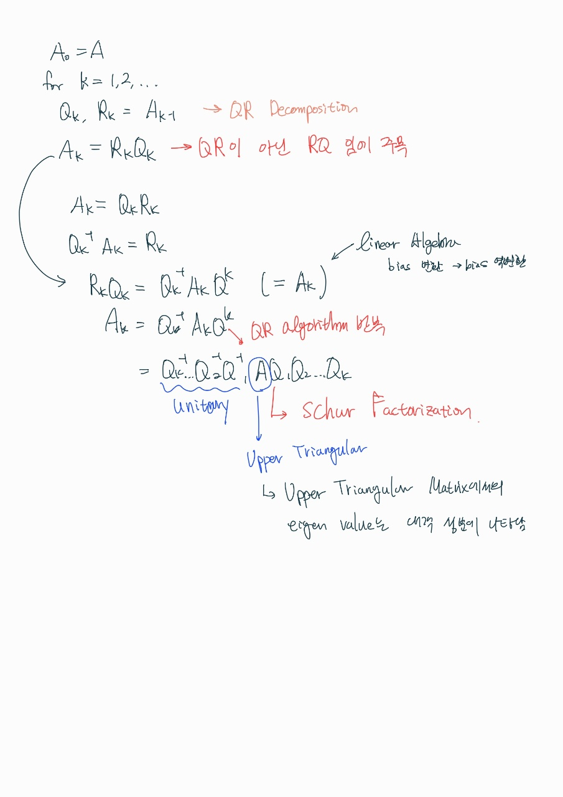

# # Chap.7: QR Algorithm

날짜: March 8, 2022
발표자: 박민호
자료: https://drive.google.com/file/d/1Pm365Venrgfm1M3NT6qVGONxGPAdDRAP/view?usp=sharing

# QR Algorithm

- 앞쪽 내용에서는 largest eigenvalue를 찾기 위해 power method를 사용
- 이번에는 symmetric, positive definite matrix에 대해 모든 eigenvalue를 찾는 방법을 알아보자
- 이 방식은 2개의 기초 알고리즘으로 구성되어있음
    - 1개는 numerical linear algebra
    - 나머지 하나는 엄청 복잡한 method
- [The Second Eigenvalue of the Google Matrix](https://nlp.stanford.edu/pubs/secondeigenvalue.pdf) 에서는 PageRank를 사용함에 있어서 알고리즘의 수렴속도, google의 스팸탐지 (웹의 링크 구조 교란) 등을 위해 second eigenvalue를 구하는 것이 중요하다고 함 (앞의 내용에서 pagerank의 수렴속도가 1st eigenvalue와 2nd eigenvalue의 비율에 비례한다고 말함)

## Avoiding Confusion : QR Algorithm vs QR Decomposition

- QR Algorithm과 QR Decomposition은 다른 개념임!
- QR Algorithm은 행렬을 QR Decomposition 시킨 이후 적용하는 알고리즘
- 뒤쪽 강의에서 QR Decomposition에 대해 자세히 설명할 예정이고, 본 강의에서는 A=QR 계산이 되었다고 가정한다 (Q : set of orthonormal columns, R : triangular matrix)

## Linear Algebra

- 아래와 같은 non-singular matrix(역행렬이 존재하는 행렬) X가 있다면 A와 B는 **similar** 하다
- $B = X^{-1}AX$
    - 왜냐? matrix X는 bias의 변환이라고 볼 수 있는데, bias를 X로 변환 해준 다음, X^-1 로 재변환 해주었기에 B와 A는 비슷하다
- Theorem : X가 non-singular이면, $A$ 와 $X^{-1}AX$ 는 같은 eigenvalue를 가진다

### More Linear Algebra

- Schur factorization
    - $A=QTQ^*$
    - Q : unitary
    - T ; upper-triangular
- 모든 사각행렬은 Schur factorization을 가진다.

## Algorithm

- QR algorithm의 기본버전은 다음과 같다

```python
for k=1,2,...
	Q, R = A
	A = R @ Q
```

- 적절한 가정 아래에서 이 알고리즘은 A의 Schur 형식으로 수렴함

### Why it works?



### Pure QR

```python
def pure_qr(A, max_iter=50000):
    Ak = np.copy(A)
    n = A.shape[0]
    QQ = np.eye(n)
    for k in range(max_iter):
        Q, R = np.linalg.qr(Ak)
        Ak = R @ Q
        QQ = QQ @ Q
        if k % 100 == 0:
            print(Ak)
            print("\n")
    return Ak, QQ
```

- 굉장히 느리고 수렴이 보장되지도 않음

### Practical QR (QR with shifts)

- $A_k$를 바로 $Q_kR_k$로 factoring 하는 것 대신에
    1. $A_k - s_kI = Q_kR_k$
    2. $A_{k+1}=R_kQ_,k + s_kI$
- $s_k$는 $A$의 eigenvalue의 추정값으로 설정 (여기서는 $A_k$의 대각 성분 중 하나를 선택)
- 행렬의 대각 성분에 shift를 더해주는 방법은 numerical linear algebra의 많은 알고리즘에서 수렴 속도를 높여준다 (power method, inverse iteration, Rayleigh quotient iteration...)

```python
def practical_qr(A, iters=10):
  Ak = np.copy(A)
  n = A.shape[0]
  QQ = np.eye(n)
  for k in range(iters):
    sk = Ak[-1,-1]
    Q, R = np.linalg.qr(Ak- sk*np.eye(n))
    Ak = R @ Q + sk*np.eye(n)
    QQ = QQ @ Q
    if k % 3 == 0:
        print(Ak)
        print("\n")
  return Ak, QQ
```

- 하지만 QR factorization 자체가 $O(n^3)$ 이므로, QR algorithm의 time complexity는 $O(n^4)$이다. (사실상 쓰기 힘든 수준)
- 하지만 특수한 케이스의 행렬은 이보다 더 빨리 계산 가능하다
    - symmetric matrices : $O(n^3)$
    - Hessenberg matrices (zeros below the first subdiagonal) : $O(n^3)$
    - Hessenberg & symmetric matrices = $O(n^2)$
    

### 질문

- schur factorization의 Q는 unique 결정하게 되는건지
    - [https://www.home.uni-osnabrueck.de/mfrankland/Math416/Math416_SchurDecomposition.pdf](https://www.home.uni-osnabrueck.de/mfrankland/Math416/Math416_SchurDecomposition.pdf) 이거 참고해보시면 eigenvalue 구해서 계산하는거라 유일하게 존재하는 것 같네요
    - [https://docs.scipy.org/doc/scipy/reference/generated/scipy.linalg.schur.html](https://docs.scipy.org/doc/scipy/reference/generated/scipy.linalg.schur.html) scipy에서도 schur factorization을 제공합니다.
- sk는 임의로 저장해도 되는가? 되더라.