# Anomaly detection

## OVERVIEW

Anomaly detection의 목표는 비슷하게 생긴 객체들 사이에서 다른 객체를 탐지하는 것이다.

고전 적인 machine learning의 개념에서 기계가 학습이 가능하다고 말하는 것은 어떠한 task T에 대해 얼마나 학습을 잘하는지를 측정하는 performance measure P가 있을 때, 충분한 경험, 즉 데이터 E를 제공해주면 P가 상승 된다는 것이다.

**Unsupervised learning**에서 우리는 주어지는 데이터에 대한 distribution을 추정하거나, 데이터 간 cluster를 찾거나, 데이터 간 association을 분석하는 것들을 각각의 node에 대해 network를 구성해서 파악한다.

**Supervised learning**에서는 데이터와 이에 대한 설명을 해주는 label 값 사이의 관계인 model f를 찾는 것이 목적이다.

Anomaly detection이란 분야에 따라 비슷하게 쓰이는 단어가 많다. 예전 자료들을 보게 된다면 noverity detection, outlier detection이라는 단어가 쓰였다.

Anomaly data에 대해 크게 2가지 관점이 존재한다.

1. Mechanism of data generation에 대한 관점
    
    : 일반적인 데이터와 다른 mechanism에 의해 발생한 데이터들이다. 꼭 동일한 mechanism에서 데이터가 만들어 질 필요는 없다. 이들은 발생 빈도만 낮을 뿐이다!
    
2. Data density에 대한 관점
    
    :  Anomaly data들은 굉장히 낮은 밀도에서 만들어진 데이터 들이다. 즉 발생 확률이 적은 데이터 들이다!
    

### Outlier vs Noise

기계 학습 또는 데이터 분석을 하다보면 noise라는 단어를 매우 많이 듣게 되는데, noise와 outlier는 구분해서 살펴야 한다.

**noise**는 각 변수들을 수집하는 과정에서 자연적으로 들어가는 변수 간 변동성이다. noise가 반드시 제거되어야 하는 것은 아니다. noise는 항상 데이터에 내제되어 있다.

**Outlier**는 반드시 찾아야하는 insteresting variable이다. 일반적인 데이터를 생성하는 mechanism을 위배함으로써 만들어 진 변수들이다. 이를 찾는 것이 굉장히 큰 domain이 되는 경우가 많다.

### Anomaly detection vs Classification

Anomaly detection의 목적 자체는 supervised learning과 같다. 그 이유는 해당 데이터가 outlier인지 아닌지 판단을 해야되기 때문이다. (전체적인 목적만 보면 $p(y\mid x, \theta)$를 구해야 되기 때문이다. $y = \left\{0 , 1\right\}$)

하지만 실질적인 행동은 unsupervised learning을 한다. 이를 자세히 알아보자.

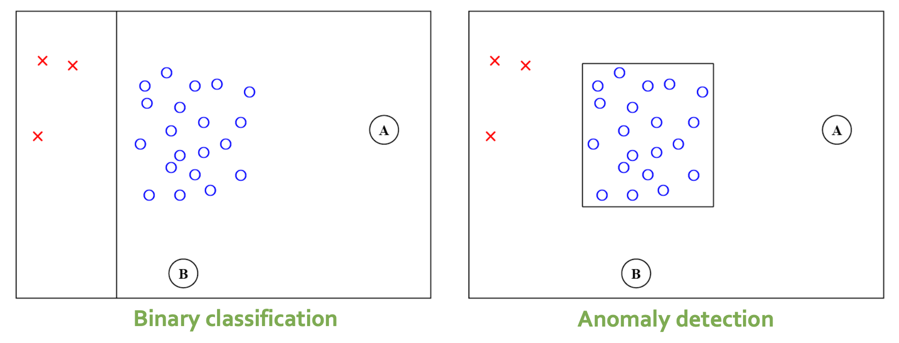

왼쪽에 해당하는 **Binary classification**은 2가지의 종류에 대한 데이터의 boundary를 찾는 문제로 정의된다. 하지만 오른쪽 **Anomaly detection**은 일반적인 classification 문제와는 다르게 outlier data의 수가 적기 때문에 outlier data들이 outlier를 대표할 수는 없다. 따라서 anomaly detection은 normal data를 통해 boundary를 결정하게 된다.

위 그림에서 새로운 데이터인 $A, B$에 대해 classification은 주어진 label 값 중 무조건 1가지에 포함이 되어야하지만, anomaly detection에서는 boundary를 정해두고 이외의 밖에 속하는 값들을 normal이 아니다라고 판단한다.

이를 쉬운 예시로 설명하면 애기한테 사과와 바나나를 구분하는 문제로 생각할 수 있다.

**Classification**

: 애기한테 사과와 바나나에 대한 이미지를 많이 보여주고 판단시킨다.

**Anomaly detection** 

: 애기한테 사과 이미지만 보여주고 어느 범위까지가 사과인지 판단 시키는 문제. 사과를 동그랗다고 정의하면 수박도 사과가 될 수도 있고, 빨간색이 사과라고 하면 청사과는 outlier라고 판단 할 수 있다. 따라서 데이터에 대한 이해가 더욱 필요하다.

### Generalization vs Specialization

Generalization과 specialization은 사이에는 반드시 trade off가 존재한다. 어떤 데이터에 대해 genaeralization이 커지면 실제 range와는 다르게 범주가 매우 커질 수도 있고, 반대로 specialization을 증가시키면 너무 tight해져서 실제 정상 데이터를 비정상으로 판단 할수도 있다.

따라서 이를 잘 설정해야한다.

### When we use the anomaly detection?

실질적으로 어떠한 문제를 해결할 때 anomaly detection을 써야되냐 classification을 써야되냐라는 질문이 있을 수 있다. 결론적으로 말하자면 classification이 정확도가 대체적으로 매우 높고 난이도도 쉽다.

이는 주로 2가지 조건을 따지며 결정한다.

1. Data imbalancing
    
    : 7:3 정도는 괜찮지만 outlier 특성상 99:1 이렇게 된다면 매우 심각하다. 어느 정도 cover가 가능하면 classification으로 접근하자
    
2. Abnoramal class에 대한 데이터 수
    
    : 만약 충분하다면 under/over sampling을 통해 classification을 진행하는 것이 훨씬 좋다.
    Under sampling: 데이터가 많은 label을 적은 label의 데이터 수와 맞춘다.
    
    Over sampling: 데이터가 적은 label의 data를 복제 또는 GAN 등을 통해 복사 시킴
    
    하지만 abnormal data가 충분하지 않다면 anomaly detection을 쓰는 것이 좋다. 1번과 차이는 양품과 불량품을 분류하는데 있어 양품이 1000000개 있고, 불량품이 10000개 있으면 그냥 classification으로 접근하는 것이고, 양품이 10000개 있고 불량품이 100개 있으면 anomaly detection으로 접근하는 것이 더 좋다는 것이다.
    

물론 classification으로 푸는 것이 모든 면에서 좋지만, 현실적인 문제에서는 예측하지 못하는 abnormal data도 매우 많다.

### Type of Abnormal Data

1. Global outlier
    
    : 다른 데이터와 태생적으로 완전히 다른 데이터들. 누가 봐도 abnormal이라고 생각하는 데이터
    
2. Contextual outlier
    
    : 상황과 환경에 따라 정상이 될수도 있고, 비정상이 될 수도 있는 데이터들. 예를 들어 북극에서 30도와 사막에서 30도는 다르다.
    
3. Collective outlier
    
    : 집단을 이루는 outlier들을 의미한다. 예를 들어 Dos 공격에서 비정상적 접속을 하는 client들이 된다.
    

### Challenges

1. Anomaly detection은 Abnormal data를 충분히 확보한 상황이 아닌, normal data만을 가지고 train을 진행한다. 따라서 normal, abnormal data에 대해 modeling을 하기에 난이도가 높다. abnormal data의 크기가 작은 것도 영향이 있지만 그보다 boundary를 정의하기가 힘들다. 구분하기 힘든 영역을 **gray area**라고 부른다. 데이터들은 연속적이기 때문에 boundary를 반드시 결정해야 한다.
2. 우리가 해결하고자 하는 domain에 따라 generalization과 specialization에 대한 trade off를 정의해야 한다. 각 문제에 따라 비율이 다르다. 의료 데이터의 경우에는 평균과 조금만 떨어져도 outlier가 되지만, 마케팅 데이터의 경우에는 조금 더 범위가 넓을 수 있다.
3. 결과에 대해 이해가 되야한다. 왜 컴퓨터가 이를 이상치로 판단했는지, 어떤 domain이 abnormal에 많이 기여했는지 알아햐 한다.

### Performance Measures

기본적으로 train 할 때는 위에서 언급한 바와 같이 normal dataset만 필요로 하고, test시에는 normal, abnormal dataset이 필요하다. 물론 절대적인 수치는 normal이 훨씬 많다.

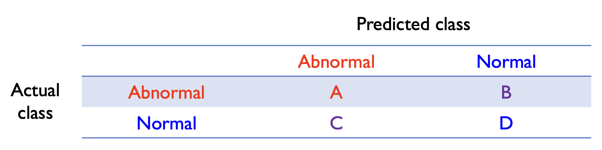
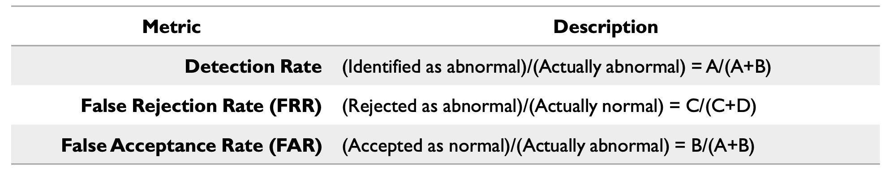

**Detection rate:** 실제 비정상 중 비정상 데이터로 판단한 비율

**FRR:** 실제로는 정상인데 비정상으로 판단한 비율

**FAR:** 실제로는 불량인데, 정상으로 예측한 비율

위 지표들은 정상과 비정상에 대한 threshold가 정해졌을 때만 계산이 가능하다. 따라서 우리는 threshold 값을 결정하면서 위 지표 값들을 구해야 한다.

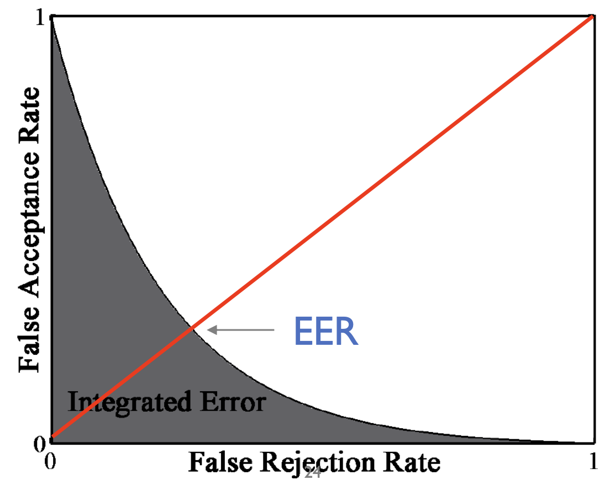
따라서 계속 threshold 값을 변경해가면서 측정을 해야한다.

x축을 FRR, y축을 FAR로 두고 plot화 하면 위 그림처럼 나오게 된다. FRR과 FAR은 서로 반리례 관계를 갖고 있는 모습을 확인 할 수 있다.

IE (Integrated Error)는 auroc 계산과 같이 curve 아래에 대한 넓이이다.

EER (Equal Error Rate)는 FAR과 FRR의 동등한 error 비율에 대한 지점이다.

우리는 최종적으로 IE와 EER을 최소화하는 threshold 값을 결정해야 한다.

## Gaussian Density Estimation

Density 기반의 anomaly detection의 목적은 abnormal data의 [2번째 관점](https://www.notion.so/Anomaly-detection-1-c39c1423861f43438d5e8580239c5c9d)에 맞춰져있다. 이는 먼저 정상에 대한 데이터의 분포를 먼저 추정한 후 이 분포에 대해 새로운 데이터가 들어오는데, 해당 데이터가 생성될 확률이 높으면 정상으로 판별하고, 낮으면 비정상으로 판별한다.

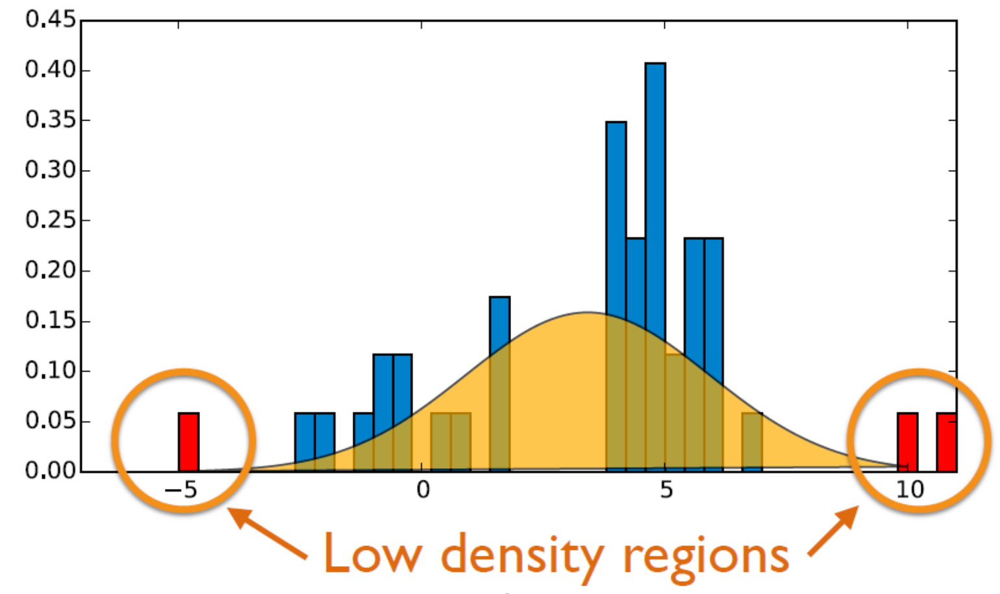
위 그림에서는 데이터의 생성 확률 분포가 Gaussian이라고 가정한다. 새로운 데이터가 들어 왔을 때, Gaussian distribution의 $\mu$와 가깝게 생성이 된 경우라면  정상이라고 가정하고, 빨간 색 데이터와 같이 일정 확률 이하에서 발생한 데이터라면 비정상이라고 판변한다.

핵심은 데이터로 부터 density function을 추정하는 것이다.

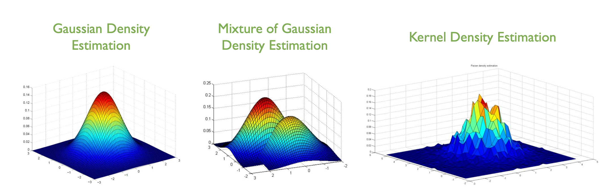

우리가 살펴볼 Gaussian density estimation의 종류는 크게 3가지가 있다. 위 그림은 각 종류에 따른 plot화 된 모습이다.

맨 왼쪽 plot은 Gaussian Density Estimation이며, 이는 전체 데이터가 1개의 Gaussian distribution으로부터 생성되었다고 가정하고 평균 벡터와 공분산 행렬을 estimation하며 학습을 진행한다.

가운데 plot은 Mixture of Gaussian Density Estimation 이며 Gaussian distribution의 개수가 1보다는 크지만, 학습 데이터에 대한 instance보다는 작다고 가정할 때이다. 만약 Gassian distribution과 instance의 수가 같은 경우에는 맨 오른쪽과 같이 Kernel Density Estimation이 되며, 이는 각 instance들은 Gaussian distribution의 중심임을 가정하고, 이로부터 주어진 정상 데이터 영역의 밀도를 추정한다.

### 1. Gaussian Density Estimation

모든 관측치들은 1개의 Gaussian distribution으로부터 sampling 및 생성이 되었다고 가정한다. 이렇게 된다면 density function이 명확하게 정의 된다. 식은 다음과 같다.

$$
p(x) = \frac{1}{(2\pi)^{\frac{d}{2}}\mid \sum \mid^{\frac{1}{2}}}exp\left[
\begin{array}{cc}
\frac{1}{2}(\bold{x} - \mu)^{T} \sum^{-1}(\bold{x} - \mu)
\end{array}
\right]
$$

우리가 위 식에서 찾아야하는 parameter는 굉장히 많은 $\bold{x}$가 주어졌을 때, $\mu$와 covariance matrix인 $\sum$을 찾으면 된다.

Gaussian density estimation의 첫번째 장점은 데이터의 범위에 민감하지 않다. 이를 다른 말로하면 robust인데, 다음과 같이 구성이 되어 있다고 가정하자.

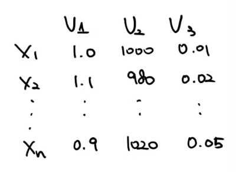

다른 model에서는 해당 element 값들을 scailing 해야지 normalization을 할 수 있다. 하지만 Gaussian에서는 covariance matrix를 구하기 때문에 변수에 대한 측정 단위에 민감하지 않다. 이를 다른 말로 하면 insentive하다는 것이다. 따라서 값에 대한 normalization 과정이 필요하지 않다.

두번째 장점은 optimal threshold를 분석적으로 compute할 수 있다. 이는 예를 들어 신뢰 구간을 95%로 잡을 때 5% 정도는 잘 못맞춘다고 가정해서 계산을 진행할 수 있다는 의미이다.

다시 말하면 학습 데이터로부터 처음부터 rejection에 대한 1종 오류에 대한 정의를 먼저 할 수 있다.

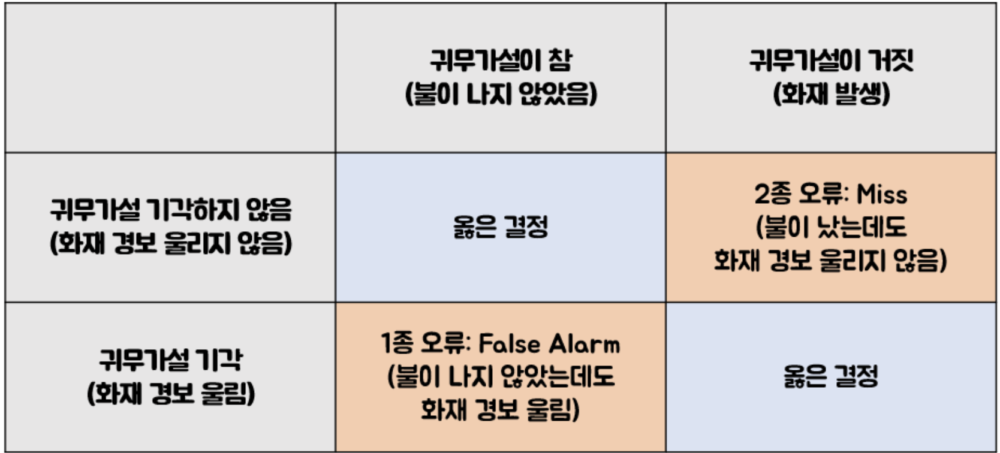

1차원 데이터로부터 실제로 계산을 해보자. 결국 parameter를 통해 현재 존재하는 데이터를 실제 생성할 가능성이 가장 높은지를 추정할 수 있다. MLE를 통해 $\mu$와 $\sigma^{2}$에 대해 식을 정의할 수 있다.

데이터는 $i.i.d$라고 가정한다.

$$
L = \prod_{i = 1}^{N}p(x_{i}|\mu, \sigma^{2}) = \prod_{i=1}^{N}\frac{1}{\sqrt{2 \pi}\sigma}exp(-\frac{(x_{i} - \mu)^{2}}{2\sigma^{2}}) \\
LogL = -\frac{1}{2}\sum^{N}_{i = 1}{\frac{(x_{i} - \mu)^{2}}{\sigma^{2}}} - \frac{N}{2}log(2\pi \sigma^{2})
$$

식을 살펴보면 데이터를 $i.i.d$로 가정하였기 때문에 각 데이터에 대한 확률을 곱해주었다. 또한 $p$에 대한 함수는 위에서 정의한 Gaussian으로 넣어 주었다.

위 식을 최적화하기 위해 각 $\mu$와 $\sigma$에 대한 편미분 값을 0으로 만들어야 한다. 하지만 $\sigma$를 그냥 쓰기에는 계산하기 가 힘들어 $\gamma = \frac{1}{\sigma^{2}}$로 치환하여 계산해보자.

$$
LogL = -\frac{1}{2}\sum^{N}_{i = 1}{\gamma(x_{i} - \mu)^{2}} - \frac{N}{2}log(2\pi) +\frac{N}{2} log(\gamma)\\
\frac{\partial LogL}{\partial \mu} = \gamma \sum^{N}_{i = 1}{(x_{i} - \mu)} = 0 \rightarrow \mu = \frac{1}{N} \sum^{N}_{i = 1}{x_{i}} \\
\frac{\partial LogL}{\partial \gamma} = -\frac{1}{2} \sum^{N}_{i = 1} (x_{i} - \mu)^{2} + \frac{N}{2 \gamma} = 0 \rightarrow \sigma^{2} = \frac{1}{N}\sum^{N}_{i = 1}(x_{i} - \mu)^{2}
$$

계산을 진행하면 결국 $\mu$는 현재 가지고 있는 train set에 normal sample에 대한 평균 값이다.

$\sigma^{2}$ 값은 train set에 normal sample에 대한 분산 값이 된다.

결국 MLE 식은 너무 당연하게도 평균은 정상 데이터에 대한 평균, 분산도 정상 데이터에 대한 분산 값이 나온다.

이를 다차원으로 확장해서 일반화 해보면 식은 다음과 같이 나오게 된다.

$$
\mu = \frac{1}{N} \sum^{N}_{i=1} \bold{x}_{i}, \ \ \ \textstyle \sum = \frac{1}{N}(\bold{x}_{i} - \mu)(\bold{x}_{i} - \mu)^{T}
$$

위와 같이 평균도 정상 데이터들의 평균이 나오게 되고, covariance matrix도 정상 데이터들의 대한 covariance matrix가 된다.

Gaussian Density Estimation은 normal의 평균과 공분산만 계산하면 되기 때문에 Gaussian 분포식 자체의 시간 복잡도는 constant time이다.

여기서 1가지 issue는 covariance matrix에 대한 결정이다.

Spherical cov matrix를 사용하면 모든 변수가 동일한 분산을 갖는다고 가정을 한 것이다.

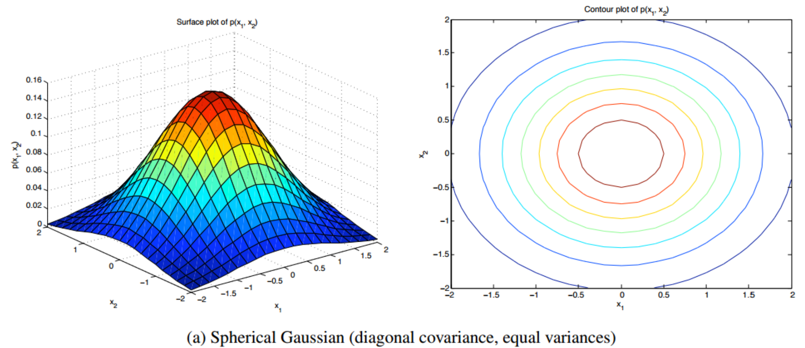

오른쪽 그림과 같이 수평 및 수직이면서 원의 형태를 갖는다. 이는 가장 엄격한 가정이다.

만약 cov matrix를 변수들은 독립이긴 한데, 다른 분산 값을 갖는 diagonal cov matrix라고 가정하면 다음과 같다.

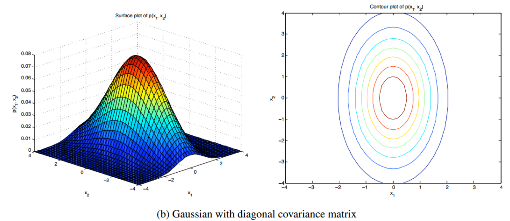
여전히 등고선들이 축에 수직 및 수평하지만 타원의 형태를 띄는 것을 볼 수 있다.

모든 cov matrix에 대한 가정을 완화하면 그냥 full cov matrix가 되는데 이는 다음 그림과 같이 보여진다.

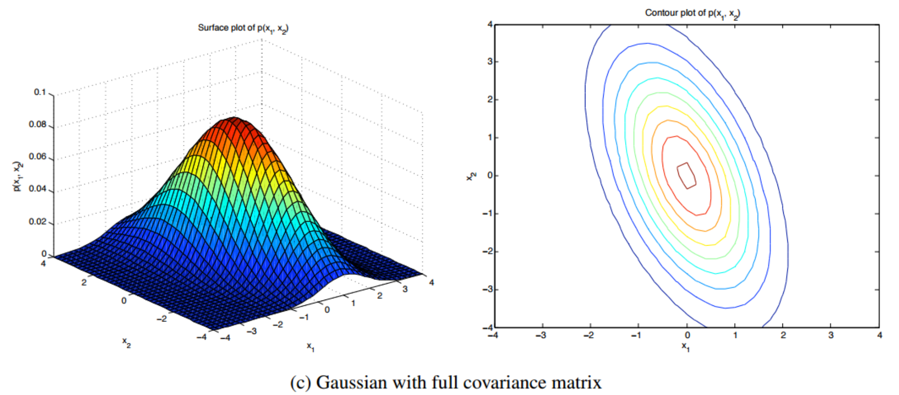

수직, 수평을 만족하지 못하면서 타원으로 변한 모습을 볼 수 있다

따라서 데이터가 충분히 많고, cov matrix가 not singular matrix이면 full cov를 쓰는 것이 좋긴 하지만 현실적으로 환경적 문제와 noise 문제 등 데이터에 대한 변동성에 대해 잘 맞지 않는 경우가 대다수다.

Gaussian Density Estimation에서 anomaly socre는 $1 - p(x)$로 구한다.

### 2. MOG (Mixture of Gaussian) Density Estimation

MOG Density Estimation은 기존 Gaussian Density Estimation의 확장판이다. 기존 조건은 데이터의 생성 확률이 unimodal 및 convex 특성을 가져야한다. 따라서 현실 존재하는 데이터 기준으로는 매우 엄격한 조건이다.

Unimodal 조건을 multi-modal로 확장해서 생각할 수 있는데, 이는 normal distribution의 선형 결합으로 표현할 수 있다. 이를 통해 기존 Gasussian Density Estimation 보다는 더욱 정확한 추정이 가능하지만, 더 많은 수의 데이터가 필요하다.

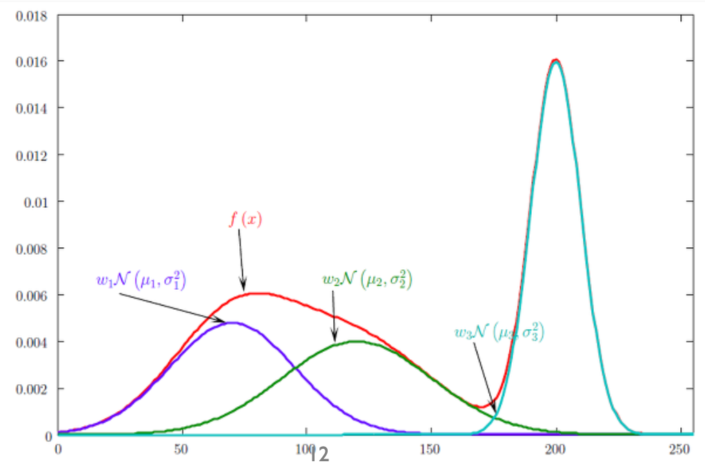

총 3개의 distribution을 가지고 가중치를 주어 선형 결합을 통해 최종적인  $f(x)$ model을 추정할 수 있다.

이를 수식으로 표현하면 다음과 같다.

$$
f(x) = w_{1} \cdot \mathcal{N}(\mu_{1}, \sigma^{2}) + w_{2} \cdot \mathcal{N}(\mu_{2}, \sigma^{2}) + w_{3} \cdot \mathcal{N}(\mu_{3}, \sigma^{2})
$$

위 식을 통해 우리가 구해야 하는  parameter의 수는 각 distribution의 $\mu_{i}, \sigma^{2}_{i}, w_{i}$ 가 된다. 여기서 추가적으로 실제 데이터의 distribution이 몇개의 Gaussian distribution을 사용했는지도 알아야 한다.

MOG의 compoments를 살펴보자. 어떠한 instance가 normal class에 속할 확률을 다음과 같이 정의한다.

$$
p(\bold{x} \mid \lambda) = \sum_{m  =1}^{M}{w_{m}g(\bold{x} \mid \mu_{m}, \textstyle \sum_{m} )}
$$

$\lambda$는 위에서 설명한 우리가 추정해야하는 미지수의 집합이다. $M$은 전체 gaussian의 개수이다.

위 식을 통해 새로운 instance가 normal에 속할 확률 값은 각 gaussian distribution에 대한 Likelihood로 계산한 다음 가중치를 곱한 총 합이 된다.

참고로 $g()$는 앞에서 정의한 [Single Gaussian density function](https://www.notion.so/Anomaly-detection-1-c39c1423861f43438d5e8580239c5c9d)의 식이 된다.

이제 이에 대한 최적화를 진행해야한다. machine learning에서 최적화 기법은 많지만 여기서는 Expectation-Maximization Algorithm을 사용한다.

Expectation-Maximization Algorithm의 설명은 다음과 같다.

이는 어떠한 미지수 $x,y$가 존재할 때 $x, y$는 동시에 최적화 할 수 없는 상황이라고 가정한다. 여기서 $x$를 고정시켜두고 $y$에 대해서 최적화를 시킨다. 그 후 $y$를 고정시키고 $x$에 대해 최적화를 진행한다. 이를 반복하다보면 결국 $x$와 $y$가 최적화 지점에 수렴하게 된다. 이를 통해 한번에 1개에 대한 미지수만 최적화를 진행한다.

MOG에서 우리가 추정해야 하는 것은 $w, \mu, \sigma$가 있다. 이를 추정하기 위한 식은 다음과 같이 정의 된다.

$$
p(m\mid \bold{x}_{i}, \lambda) = \frac{w_{m} g(x_{i} \mid \mu_{m}, \textstyle \sum_{m})}{\sum_{k =1}^{M}{w_{k} g(\bold{x}_{t} \mid \mu_{k}, \textstyle \sum_{k})}}
$$

위 식을 통해 $\bold{x}$가 어떠한 gaussian distribution에 속하는지에 대한 확률 값이다. 단순한 조건부 확률이다.

$$
w_{m}^{(new)} = \frac{1}{N}\sum_{i=1}^{N}p(m \mid \bold{x}_{i}, \lambda)\\
\mu_{m}^{(new)} = \frac{\sum_{i=1}^{N}p(m \mid \bold{x}_{i}, \lambda)\bold{x}_{i}}{\sum_{i=1}^{N}p(m \mid \bold{x}_{i}, \lambda)} \\
\sigma^{2 (new)}_{m} = \frac{\sum_{i=1}^{N}p(m \mid \bold{x}_{i}, \lambda)\bold{x}_{i}^{2}}{\sum_{i=1}^{N}p(m \mid \bold{x}_{i}, \lambda)} - \mu^{2(new)}_{m}
$$

$p$에 대한 식을 A라고 두고, 위  각 3개의 parameter에 대한 식을 B라고 하자.

A, B에 대해 Expectation-Maximization Algorithm를 적용시킨다. 이를 반복하면서 수렴하는 $w, \mu, \sigma$를 찾을 수 있다.

A 과정을 통해서는 $x$가 몇 번째 gaussian에 속하는지에 대한 확률을 구할 수 있고, B를 통해서는 그나마 optimal한 parameter를 구할 수 있다.

MOG의 특징은 $w, \mu, \sigma$에 대해서는 완벽한 optimal 값을 구하지는 못하지만 $p$를 통해 몇 번째 gaussian에서 산출되는 것이 optimal인 것을 찾을 수 있다.

MOG도 cov matrix의 type에 따라 결과가 달라진다.

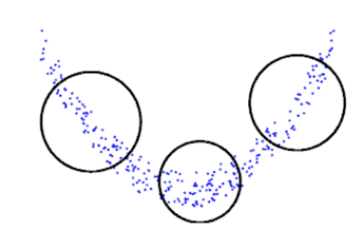
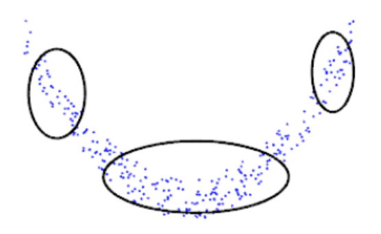
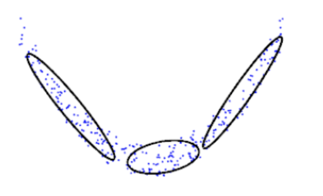

오른쪽으로 갈 수록 cov에 대한 조건이 완화가 된다. 완화가 될 수록 정밀도가 높아지지만 계산이 더욱 어려워 진다.

Full cov matrix를 사용하면 좋지만, 이는 non-singular일 때만 유용한데, 현실 데이터에서는 cov에 대한 역행렬을 구할 때 non-singular인 경우는 거의 없다.

따라서 적절한 Diagonal cov matrix를 사용하는 것이 보편적이다.

### Kernel density estimation

앞서 설명한 Gaussian density estimation, MOG density estimation은 parametric appoach이다. 이는 특정한 parameter를 갖는 distribution을 가정한 상태에서 주어진 data를 해당 distribution에 끼어 맞추는 방법이다. 이를 통해 data들에 대한 평균과 공분산 행렬을 추정한다.

Kernel density estimation은 data가 특정한 distribution으로부터 estimation 되었다라는 가정을 하지 않고, Data 자체로부터 sampling 될 확률을 추정한다. 따라서 사전에 정의된 distribution을 따르지 않기 때문에 Non-parametric density estimation이다.

| Parametric Models | Non-Parametric Models |
| --- | --- |
| Model을 parameter 관점에서 분류할 수 있다. parametric model이란 model이 가지고 있는 parameter들이 미리 정의되어있는 상태에서 fixed parameter를 가지고 학습을 하는 것을 의미한다. parametric model의 장점은 빠르게 동작하며, 구현 난이도가 비교적 쉽다. 하지만 data distribution 자체에 대해 정확하게 추정할 수 있는 알고리즘으로 설계가 되어야 한다.| Non-parametric model은 주어진 dataset $D$에 대해 학습하는 model이다. parameter의 수는 train dataset의 양에 따라 가변적이다. 이 때문에 parametric model에 비해 model이 flexible하다. 하지만 큰 data가 증가하면 train 및 test, inference의 복잡도가 parametric에 비해 상대적으로 증가되고, modeling 난이도 또한 더 어렵다. 또한 dataset의 distribution에 대한 가정 없이 주어진 data만을 가지고 최적의 model을 구하는 방법으로 parameter의 개수도 바뀔 수 있다. |

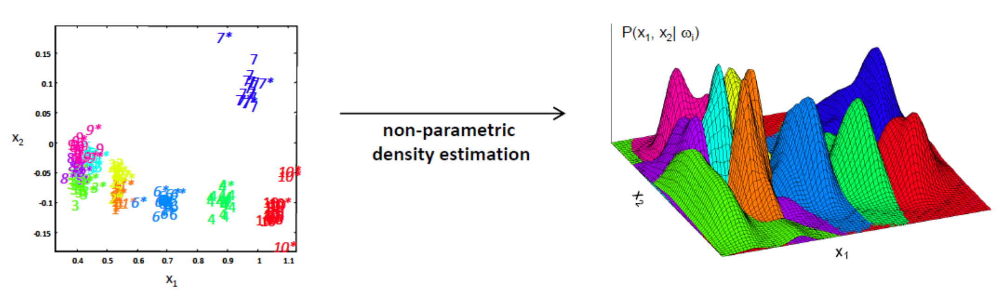
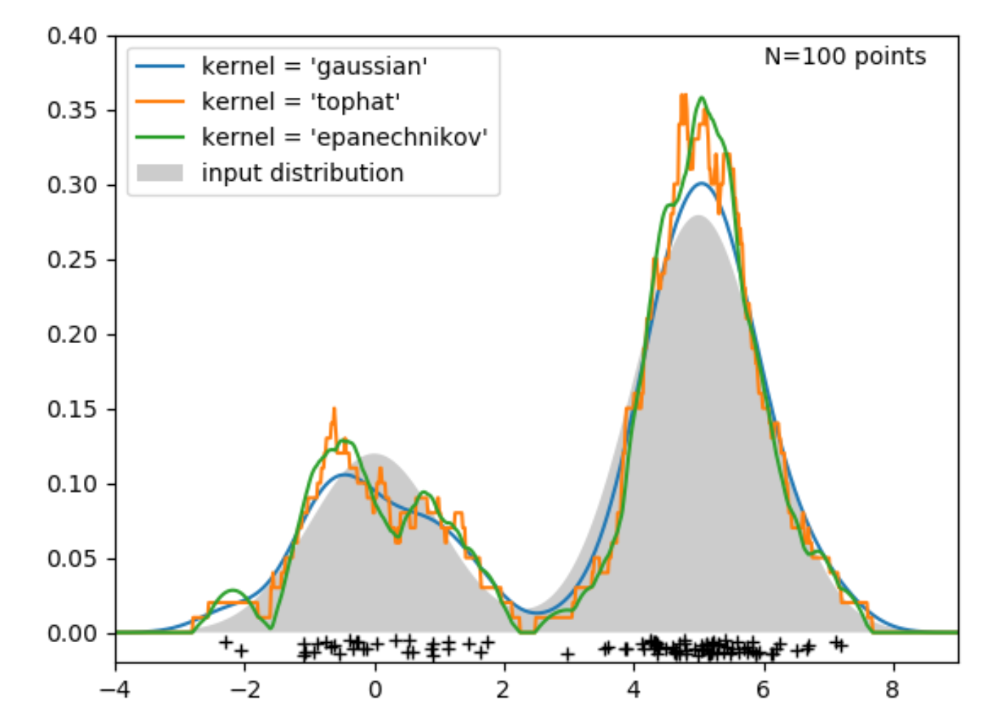

위 plot에서 아래 검정색 십자들은 실질적인 데이터들이고, 회색은 실제 데이터에 대한 분포이다. kernel function을 어떠한 얘를 쓰냐에 따라 추정하는 분포가 달라진다.

본격적으로 kernel-density estimation을 이해하기 위한 사전 지식이 필요하다.

어떠한 데이터가 주어졌을 때, 이 데이터는 $p(x)$로부터 sampling 되었고, 이 데이터가 특정한 영역 $R$에 들어올 확률 값은 다음과 같이 수식으로 표현할 수 있다.

$$
P = \int_{R}p(x')dx'
$$

이러한 sampling이 $N$번 반복했다고 가정하자. $R.V.$를 $i.i.d.$라고 가정하고, 영역 $R$ 안에 들어올 확률과 안들어올 확률에 대해 binomail distribution을 적용할 수 있다.

$$
P(k) = \begin{pmatrix}N \\ K\end{pmatrix} P^k (1-P)^{N-k}
$$

그리고 여기서 $k$ 대신 $\frac{k}{N}$을 사용하면 binomail distribution 특성으로 평균과 분산을 구할 수 있다.

$$
E[\frac{k}{N}] = P, \ \ Var[\frac{k}{N}] = \frac{P(1-P)}{N}
$$

여기서 만약 $N$이 무한으로 간다고 가정해보자. 분산은 0에 가까워 질 것이고, 확률 값은 [Montecalro approach](https://www.notion.so/Machine-learning-Central-limit-theorem-MIC-5f857adb5e3c43c792e0e389f85ecba4)로 인해 원하는 영역의 포함되는 data의 개수만큼 근사가 될 것 이다.

이를 통해 우리는 아래 식을 얻을 수 있다.

$$
P \cong \frac{k}{N}
$$

다음은 $R$이 충분히 작은 영역이라 $p(x)$가 급격하게 바뀌지 않는 다고 가정해보자.

분포식에 존재하는 임의의 점 $x_{1}$과 $x_{2}$에 대해 $p(x_{1}) = p(x_{2})$를 만족하게 되고, 해당 영역은 $p(x_{1}) \times (x_{2} - x_{1})$으로 정의할 수 있다. 이를 통해 확률을 다음과 같이 정의할 수 있다.

$$
P = \int_{R}p(x')dx' \cong p(x)V
$$

여기 $V$ 는 volume을 의미하고, 1차원에서 volume은 직선, 2차원은 넓이, 3차원은 부피에 대당한다. 

위 2개 식을 merge하면 다음과 같이 식을 정의할 수 있다.

$$
P = \int_{R}p(x')dx' \cong p(x)V = \frac{k}{N}, \ \ p(x) = \frac{k}{NV}
$$

이는 영역 $R$에 존재하는 실제 객체 수를 (시행 횟수 * 볼륨)의 식으로 근사할 수 있다.

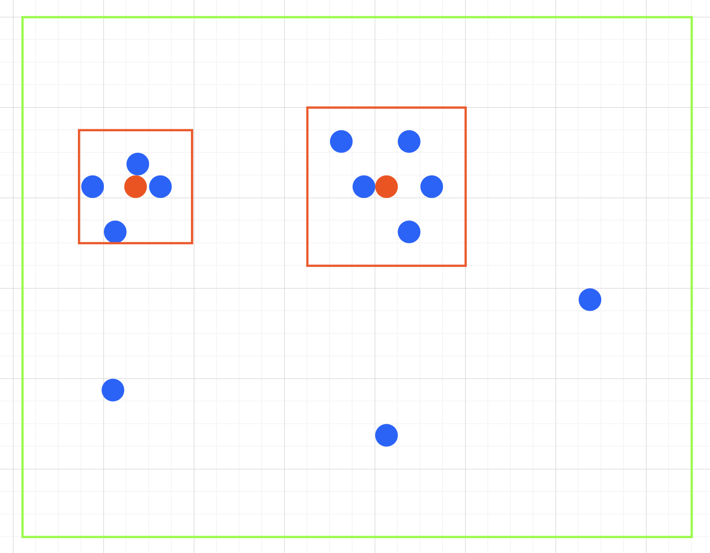

위 식을 시각적으로 이해하기 위해 위와 같은 그림이 있다고 가정하자. 관심 영역 $R$을 빨간색 사각형으로 잡고, 전체 데이터가 총 12개가 존재 한다고 하면, 첫 번째 왼쪽 영역의 확률을 $\frac{4}{12\times3^{2}}$로 표현할 수 있다. (사각형 선분의 길이가 3이라고 했을 경우) 두 번째 관심 영역은 $\frac{5}{12*5^{2}}$으로 표현 할 수 있다.

여기서 빨간 색 점은 영역에 대한 무게 중심 이다.

이러한 방법으로 데이터를 통해 분포를 근사하는 것이 kernel density estimation의 목적이다.

$N$ 값이 커질 수록, $V$ 값이 작아질 수록 estimation의 정확도는 올라간다. 우리는 보통 $N$을 알고 있는 상태로 진행함으로 상수로 두고, $V$에 대한 적절한 값을 조정하는 것을 목표로 하는데, $V$는 이론적으로 2가지 조건을 만족해야 한다.

1. $R$안에 많은 sample들을 충분히 넣어야 한다.
2. $R$안에 있는 데이터들의 $p$는 constant해야 한다.

## Parzen Window Density Estimation
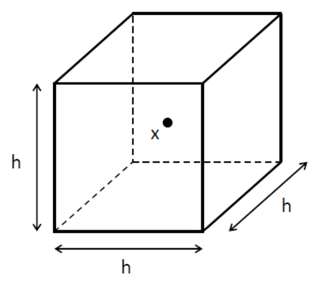
영역을 정의하기 위해 추정하고자 하는 확률 $p(x)$를 무게 중심 $x$를 가지면서 각 길이가 $h$인 hyper cube를 만든다고 가정하자. 차원을 $d$라고 할 때 hyper cube의 volume은 $V = h^{d}$가 된다.

이를 통해 kernel function $K(u)$를 정의하면 수식은 다음과 같다.

$$
K(u) = \begin{cases}
1 \ |u_{j}|< \frac{1}{2}, \ \ \forall j = 1, \dots,d \\
0 \ \ \text{otherwise}
\end{cases}
$$

관심 영역 $R$에 존재하는 데이터의 개수 $k$는 다음과 같은 수식으로 구할 수 있다.
$$
k = \sum_{i=1}^{N}K(\frac{\bold{x}^{i}- \bold{x}}{h})
$$
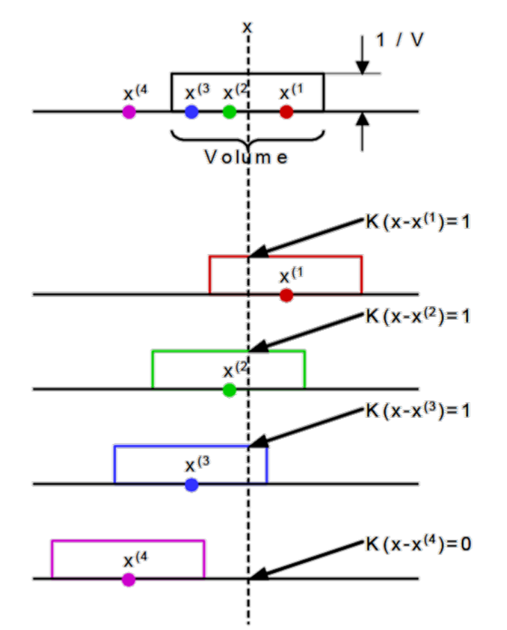
위 수식을 2차원에서 시각화하면 그림과 같다. 여기서 $K$가 의미하는 것은 $x$를 기준으로 관심 영역 안에 들어오는 데이터의 존제를 측정하는 함수가 된다. 위 그림에서 $k$는 3이 된다.

그리고 이를 통해 확률 $p$를 다음과 같이 정의할 수 있다.

$$
p(x) = \frac{1}{Nh^{d}}\sum_{i=1}^{N}K(\frac{\bold{x}^{i}- \bold{x}}{h})
$$

위에서 정의한 $k$와 volume인 $V$를 곱한 값이 $p$가 된다.

이를 통해 $x$를 옮겨가면서 전체에 대한 확률 밀도 함수를 구할 수 있었다. 이것이 바로 Parzen Window Density Estimation의 개념이다. 우리는 이 과정에서 데이터가 어떤 분포를 따른다고 정의를 하지 않고, 관심 영역의 존재하는 지에 대한 불연속적인 counting을 진행하였다.
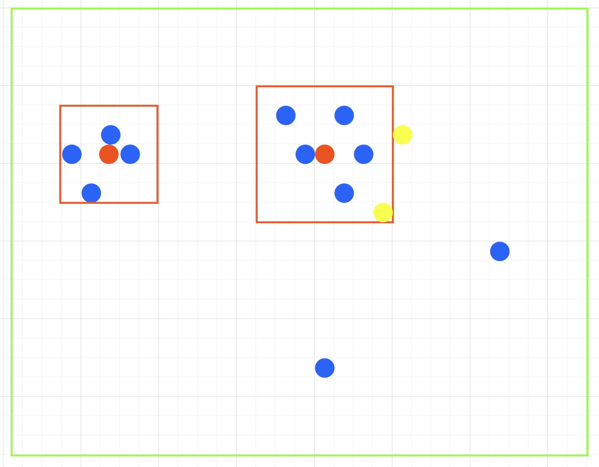

위 그림을 보면 2번째 관심 영역을 보면 노랑색 데이터가 2개가 존재한다. 두 데이터의 관심 영역 포함 여부가 다르지만 중심 점으로부터 distance는 그렇게 차이가 나지 않는다.

경계 기준으로 이렇게 값이 달라지는데, 이를 불연속적이라고 하고, 이를 해결하고자 smooth kernel function을 사용한다.
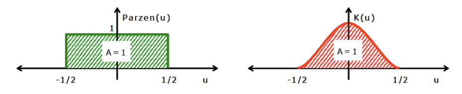
Smooth kernel function은 적분 값이 1인 것을 만족해야 한다. 이를 반대로 말하면 적분 값이 1인 함수들은 모두 smooth kernel function이 될 수 있다는 의미이다.

여기서 가장 기본적으로 도입할 수 있는 함수는 Gaussian이고, 각 데이터의 중심을 gaussian의 중심으로 보고 이에 대해 얼마나 떨어졌는 지 개별적으로 확률을 계산한 다음, 전체에 대한 확률 계산을 하는 것이 Parzen window density estimation이다.
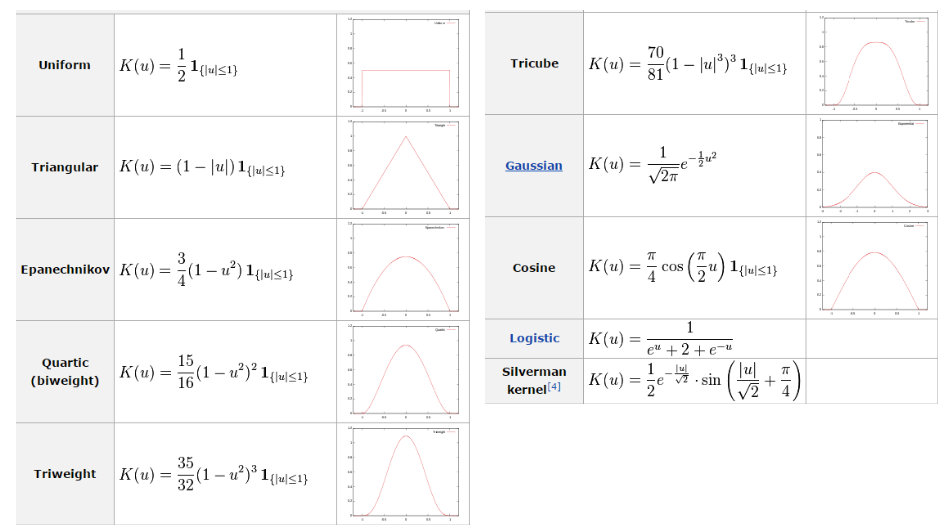
다음과 같은 Smooth kernel function들이 존재한다.
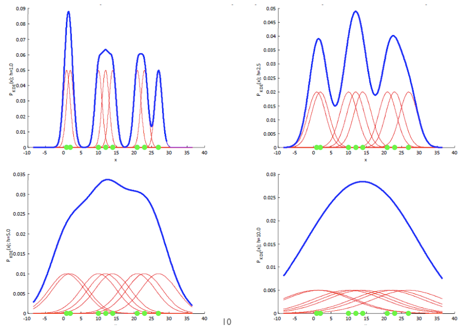
Smooth parameter인 h가 크면 오른쪽 아래 그래프와 같이 overshooting을 한다. 반대로 작으면 위 그림들 처럼 spiky하게 된다. 따라서 MLE 등의 method를 통해 h를 결정하는 것이 parzan의 학습 과정이다.
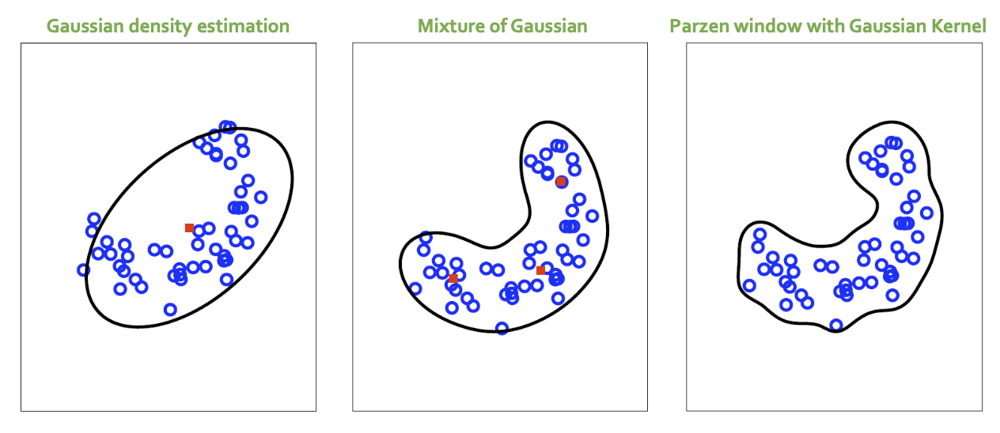
지금까지 설명한 밀도 기반 이상치 탐지의 개념을 다시보면 왼쪽 Gaussian은 중심이 한 개 존재하고, 타원으로 표현할 수 있다. MOG를 통해 3개의 gaussian을 가지고 estimation을 하면 범위가 조금 더 유연해지고, paran의 경우에는 데이터 각 gaussian을 갖기 때문에 학습이 더욱 잘되는 모습을 볼 수 있다.

### Parzen 알고리즘 구현

```python
import numpy as np
import seaborn as sns
import matplotlib.pyplot as plt

def normal_kernel(u):
    return np.exp(-(np.abs(u) ** 2) / 2) / (h * np.sqrt(2 * np.pi))

def uniform_kernel(u):
    return np.where(np.abs(u) <= 1, 1, 0) / 2

data = [-2.1, -1.3, -0.4, 1.9, 5.1, 6.2]
h = 5
kernel = 'normal'

len_array = 1000
p_x = np.zeros(len_array)
x = np.array(sorted(np.random.uniform(-5, 10, len_array)))

for x_i in data:
    u = (x - x_i) / h
    p_x_i = np.array(kernel_function(kernel, u)) / len(data)
    p_x += p_x_i
    sns.lineplot(x=x, y=p_x_i, color='green', linestyle='--')

sns.lineplot(x=x, y=p_x, color='blue').set(title='{} (h={})'.format(kernel, h), xlabel='x', ylabel='Density Function')
sns.rugplot(data, height=0.02, color='red')

plt.show()
```
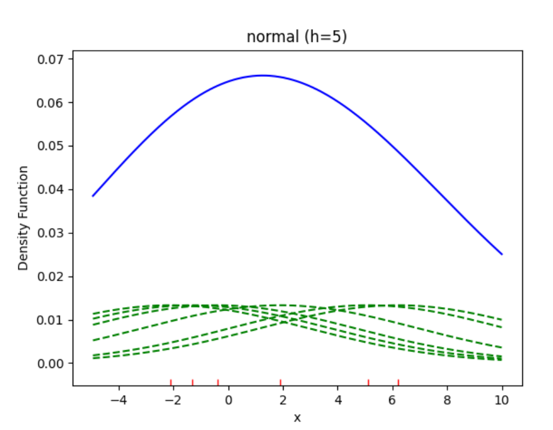
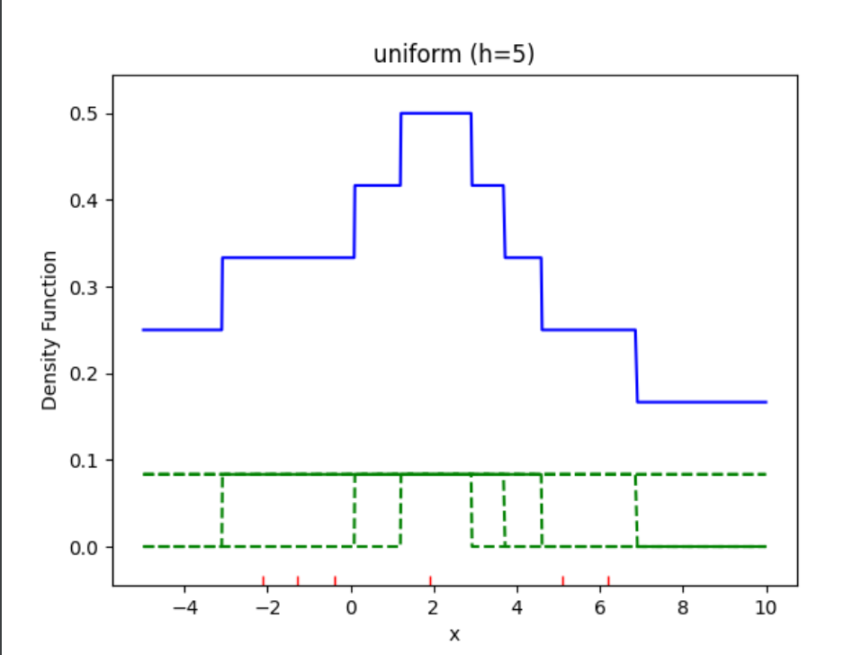